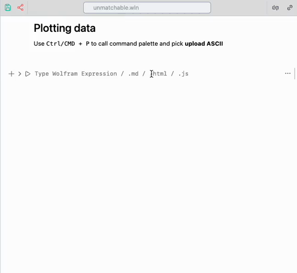

# Plotting data
Use `Ctrl/CMD + P` to call command palette and pick __upload ASCII__

import { WLJSHTML, WLJSEditor, WLJSStore } from "@site/src/components/wljs-reactcells";

<WLJSStore json={require('./attachments/1d560f85-f576-45b6-9f50-6c363d1baa6a.txt').default} notebook={require('./attachments/notebook-1d5.wln').default}/>

Once you finished, an special symbol will appear. You can work with it if it was a array of data compressed to a size of single icon.

**Example data***

<WLJSEditor display={"codemirror"} nid={"1d560f85-f576-45b6-9f50-6c363d1baa6a"} id={"b67787d9-b6c0-4db1-96f9-69bce75f97a4"} type={"Input"} opts={{}} >{`%28%2AVB%5B%2A%29%28Get%5BFileNameJoin%5B%7B%22.iconized%22%2C%20%22iconized-dd15.wl%22%7D%5D%5D%29%28%2A%2C%2A%29%28%2A%221%3AeJxTTMoPSmNkYGAoZgESHvk5KRAeH5DwTM7Py6xKdcvMSXXKr8gU0OBhAADq%2BQq5%22%2A%29%28%2A%5DVB%2A%29`}</WLJSEditor>

Now you can copy and paste this symbol

<WLJSEditor display={"codemirror"} nid={"1d560f85-f576-45b6-9f50-6c363d1baa6a"} id={"46a9bce1-38b4-4538-ab46-211b9bf93d31"} type={"Input"} opts={{}} >{`ListLinePlot%5B%28%2AVB%5B%2A%29%28Get%5BFileNameJoin%5B%7B%22.iconized%22%2C%20%22iconized-dd15.wl%22%7D%5D%5D%29%28%2A%2C%2A%29%28%2A%221%3AeJxTTMoPSmNkYGAoZgESHvk5KRAeH5DwTM7Py6xKdcvMSXXKr8gU0OBhAADq%2BQq5%22%2A%29%28%2A%5DVB%2A%29%2C%20PlotRange-%3EFull%2C%20ImageSize-%3E500%5D`}</WLJSEditor>

<WLJSEditor display={"codemirror"} nid={"1d560f85-f576-45b6-9f50-6c363d1baa6a"} id={"782ab937-d6a7-4787-aba6-3bb33444937d"} type={"Output"} opts={{}} >{`%28%2AVB%5B%2A%29%28FrontEndRef%5B%221d8f3ab5-8dc2-4914-a7f1-f02da8ed0d59%22%5D%29%28%2A%2C%2A%29%28%2A%221%3AeJxTTMoPSmNkYGAoZgESHvk5KRCeEJBwK8rPK3HNS3GtSE0uLUlMykkNVgEKG6ZYpBknJpnqWqQkG%2BmaWBqa6CaapxnqphkYpSRapKYYpJhaAgCK%2BBYD%22%2A%29%28%2A%5DVB%2A%29`}</WLJSEditor>

*TIP: try to pan and zoom into the plot using mouse*

You can also manipulate the data, cut it or crop using Wolfram Language native tools for Lists

<WLJSEditor display={"codemirror"} nid={"1d560f85-f576-45b6-9f50-6c363d1baa6a"} id={"bc6299a8-0e4d-45f6-a9fe-7b4cfc4e9a50"} type={"Input"} opts={{}} >{`ListLinePlot%5B%0A%20%20Select%5B%28%2AVB%5B%2A%29%28Get%5BFileNameJoin%5B%7B%22.iconized%22%2C%20%22iconized-dd15.wl%22%7D%5D%5D%29%28%2A%2C%2A%29%28%2A%221%3AeJxTTMoPSmNkYGAoZgESHvk5KRAeH5DwTM7Py6xKdcvMSXXKr8gU0OBhAADq%2BQq5%22%2A%29%28%2A%5DVB%2A%29%2C%20%28%23%5B%5B1%5D%5D%20%3E%203000%20%26%26%20%23%5B%5B1%5D%5D%20%3C%204000%29%26%5D%0A%2C%20PlotRange-%3EFull%2C%20ImageSize-%3E500%5D%20`}</WLJSEditor>

<WLJSEditor display={"codemirror"} nid={"1d560f85-f576-45b6-9f50-6c363d1baa6a"} id={"bed4335c-66c5-4d54-97a7-9e9dccdca050"} type={"Output"} opts={{}} >{`%28%2AVB%5B%2A%29%28FrontEndRef%5B%22e4015242-1c6d-4aed-b9f5-799c6651958a%22%5D%29%28%2A%2C%2A%29%28%2A%221%3AeJxTTMoPSmNkYGAoZgESHvk5KRCeEJBwK8rPK3HNS3GtSE0uLUlMykkNVgEKp5oYGJoamRjpGiabpeiaJKam6CZZppnqmltaJpuZmRpamlokAgB%2BGBVR%22%2A%29%28%2A%5DVB%2A%29`}</WLJSEditor>

## Preview  data as a table
For whom likes Origin

<WLJSEditor display={"codemirror"} nid={"1d560f85-f576-45b6-9f50-6c363d1baa6a"} id={"c72f0aae-ba7b-46f0-b7dc-8115699a4196"} type={"Input"} opts={{}} >{`%28%2AVB%5B%2A%29%28Get%5BFileNameJoin%5B%7B%22.iconized%22%2C%20%22iconized-dd15.wl%22%7D%5D%5D%29%28%2A%2C%2A%29%28%2A%221%3AeJxTTMoPSmNkYGAoZgESHvk5KRAeH5DwTM7Py6xKdcvMSXXKr8gU0OBhAADq%2BQq5%22%2A%29%28%2A%5DVB%2A%29%20%2F%2F%20TableView%20`}</WLJSEditor>

<WLJSEditor display={"codemirror"} nid={"1d560f85-f576-45b6-9f50-6c363d1baa6a"} id={"107df003-1be8-4797-8677-08644f65be04"} type={"Output"} opts={{}} >{`%28%2AVB%5B%2A%29%28Dataset%5BJoin%40%40Notebook%60Kernel%60Inputs%60Private%60store%242804301%2CTypeSystem%60Vector%5BTypeSystem%60Tuple%5B%7BTypeSystem%60Atom%5BReal%5D%2C%20TypeSystem%60Atom%5BReal%5D%7D%5D%2C%208298%5D%2C%3C%7C%7C%3E%5D%29%28%2A%2C%2A%29%28%2A%221%3AeJxTTMoPSmNkYGAoZgESHvk5KRCeEJBwK8rPK3HNS3GtSE0uLUlMykkNVgEKG1kap6WYGaXompilGuqaGBsZ6loYJpnoWpgaJhuamyYaJSZaAgB4ABUM%22%2A%29%28%2A%5DVB%2A%29`}</WLJSEditor>