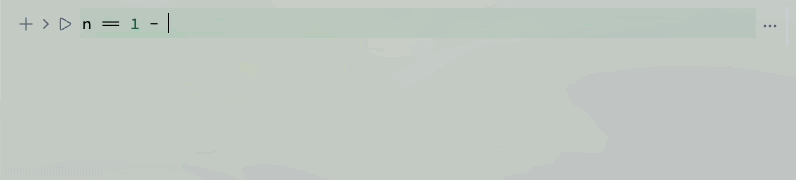

## Using shortcuts
You can enter and edit quite complex equations using just a few shortcuts 

<WLJSHTML>{`%3Cbr%20%2F%3E`}</WLJSHTML>

- `Alt+2`, `Cmd+2` hide/show input cell
- `Ctrl+/` make fraction on selected
- `Ctrl+6` make superscript on selected
- `Ctrl+2` make square root on selected
- `Ctrl+-` make subscript on selected

import { WLJSHTML, WLJSEditor, WLJSStore } from "@site/src/components/wljs-reactcells";

<WLJSStore json={require('./attachments/b69eb1cf-b0aa-48e6-a520-7caea83d5e13.txt').default} notebook={require('./attachments/notebook-b69.wln').default}/>

This is a syntax sugar borrowed from Mathematica, but implemented in a much simpler way

<WLJSEditor display={"codemirror"} nid={"b69eb1cf-b0aa-48e6-a520-7caea83d5e13"} id={"255a2931-ff45-4eaa-b9ca-7dcf3bb49c1b"} type={"Input"} opts={{}} >{`%28%2AFB%5B%2A%29%28%281%29%28%2A%2C%2A%29%2F%28%2A%2C%2A%29%282%29%29%28%2A%5DFB%2A%29`}</WLJSEditor>

If you copy and paste into a normal text editor, what you see is a normal Woflram Language code

<WLJSEditor display={"codemirror"} nid={"b69eb1cf-b0aa-48e6-a520-7caea83d5e13"} id={"6d5b89a6-4057-4e14-8cc4-eeb9b7a14407"} type={"Input"} opts={{}} >{`%28%2AFractionBox%5B%2A%29%28%281%29%28%2A%2C%2A%29%2F%28%2A%2C%2A%29%282%29%29%28%2A%5DFractionBox%2A%29`}</WLJSEditor>

Wolfram Kernel can generate them as well like you can expect in Mathematica

<WLJSEditor display={"codemirror"} nid={"b69eb1cf-b0aa-48e6-a520-7caea83d5e13"} id={"6ff08b1e-0fec-4fb6-8f33-380b722ce32e"} type={"Input"} opts={{}} >{`Series%5BSinc%5B%28%2ASqB%5B%2A%29Sqrt%5Bx%5D%28%2A%5DSqB%2A%29%5D%2C%20%7Bx%2C0%2C4%7D%5D%20%2F%2F%20Normal%20`}</WLJSEditor>

<WLJSEditor display={"codemirror"} nid={"b69eb1cf-b0aa-48e6-a520-7caea83d5e13"} id={"2abc7c33-4fcc-4182-8247-9fd0df3e0f73"} type={"Output"} opts={{}} >{`1-%28%2AFB%5B%2A%29%28%28x%29%28%2A%2C%2A%29%2F%28%2A%2C%2A%29%286%29%29%28%2A%5DFB%2A%29%2B%28%28%2AFB%5B%2A%29%28%281%29%28%2A%2C%2A%29%2F%28%2A%2C%2A%29%28120%29%29%28%2A%5DFB%2A%29%29%20%28%28%2ASpB%5B%2A%29Power%5Bx%28%2A%7C%2A%29%2C%28%2A%7C%2A%292%5D%28%2A%5DSpB%2A%29%29-%28%2AFB%5B%2A%29%28%28%28%2ASpB%5B%2A%29Power%5Bx%28%2A%7C%2A%29%2C%28%2A%7C%2A%293%5D%28%2A%5DSpB%2A%29%29%28%2A%2C%2A%29%2F%28%2A%2C%2A%29%285040%29%29%28%2A%5DFB%2A%29%2B%28%2AFB%5B%2A%29%28%28%28%2ASpB%5B%2A%29Power%5Bx%28%2A%7C%2A%29%2C%28%2A%7C%2A%294%5D%28%2A%5DSpB%2A%29%29%28%2A%2C%2A%29%2F%28%2A%2C%2A%29%28362880%29%29%28%2A%5DFB%2A%29`}</WLJSEditor>

Here is another example

<WLJSEditor display={"codemirror"} nid={"b69eb1cf-b0aa-48e6-a520-7caea83d5e13"} id={"e1fa0a6e-1231-43d4-b1e7-13ed876fec91"} type={"Input"} opts={{}} >{`n%20%3D%20%28%2ASqB%5B%2A%29Sqrt%5B1%20-%20%28%2AFB%5B%2A%29%28%28%28%2ASpB%5B%2A%29Power%5B%28%2ASbB%5B%2A%29Subscript%5B%5C%5BOmega%5D%28%2A%7C%2A%29%2C%28%2A%7C%2A%29p%5D%28%2A%5DSbB%2A%29%28%2A%7C%2A%29%2C%28%2A%7C%2A%292%5D%28%2A%5DSpB%2A%29%29%28%2A%2C%2A%29%2F%28%2A%2C%2A%29%28%28%28%2ASpB%5B%2A%29Power%5B%28%2ASbB%5B%2A%29Subscript%5B%5C%5BOmega%5D%28%2A%7C%2A%29%2C%28%2A%7C%2A%290%5D%28%2A%5DSbB%2A%29%28%2A%7C%2A%29%2C%28%2A%7C%2A%292%5D%28%2A%5DSpB%2A%29%20-%204Pi%20%28%2ASpB%5B%2A%29Power%5B%5C%5BEta%5D%28%2A%7C%2A%29%2C%28%2A%7C%2A%292%5D%28%2A%5DSpB%2A%29%20%29%20-%202%20Pi%20I%20%5C%5BGamma%5D%20%5C%5BEta%5D%29%29%28%2A%5DFB%2A%29%20%20%5D%28%2A%5DSqB%2A%29%20%20%3B`}</WLJSEditor>

Then lets expand it into a series

<WLJSEditor display={"codemirror"} nid={"b69eb1cf-b0aa-48e6-a520-7caea83d5e13"} id={"2e263f39-aa6b-49de-8932-3e6240b4889c"} type={"Input"} opts={{}} >{`Series%5Bn%2C%20%7B%5C%5BEta%5D%2C%200%2C%201%7D%5D`}</WLJSEditor>

<WLJSEditor display={"codemirror"} nid={"b69eb1cf-b0aa-48e6-a520-7caea83d5e13"} id={"3a4a5d99-76be-45ff-81be-6fef8d99524d"} type={"Output"} opts={{}} >{`%28%2AVB%5B%2A%29%28SeriesData%5B%5C%5BEta%5D%2C%200%2C%20%7BSqrt%5B%28Subscript%5B%5C%5BOmega%5D%2C%200%5D%5E2%20-%20Subscript%5B%5C%5BOmega%5D%2C%20p%5D%5E2%29%2FSubscript%5B%5C%5BOmega%5D%2C%200%5D%5E2%5D%2C%20%28%28-I%29%2APi%2A%5C%5BGamma%5D%2ASubscript%5B%5C%5BOmega%5D%2C%20p%5D%5E2%2ASqrt%5B%28Subscript%5B%5C%5BOmega%5D%2C%200%5D%5E2%20-%20Subscript%5B%5C%5BOmega%5D%2C%20p%5D%5E2%29%2FSubscript%5B%5C%5BOmega%5D%2C%200%5D%5E2%5D%29%2F%28Subscript%5B%5C%5BOmega%5D%2C%200%5D%5E2%2A%28Subscript%5B%5C%5BOmega%5D%2C%200%5D%5E2%20-%20Subscript%5B%5C%5BOmega%5D%2C%20p%5D%5E2%29%29%7D%2C%200%2C%202%2C%201%5D%29%28%2A%2C%2A%29%28%2A%221%3AeJztVEtPwkAQRuPB%2BCsqp3atseUhwo0WyrtAtyBQegBboPLo9oFQ1N%2Fl33O7NUZPKAnxYrKZnfl2Mq9vM5djW5mcxGIx7wyLsr0wJqehdYFF0bB82%2B1a5ga%2B4VcaQEfQAAMd19doIIU6TWMUhVrL3piuFppj4rQeew%2BuhXxtmOOSYpYGL4BhieR0GujYCzDMFzRBUITR69%2BHRHtCYpQFzA2RR6g4hHUJKwRxoh4%2B5jPMSZlUkSIxOXIJSeqAGva2SIL%2BE%2FRDgpiIisz3xEfIfAjXf0HA54iuaNAlPwearmV6hZE%2F0qJZsRTHUs%2BvLJUgh9ej4dEgzufM6lZVG3YLLuV5v5S3B9MiLD%2FN07X7RaMipHrzsiAHcFetb9y6KnItfioF8hiKYjqwfLVduPN81bqtZ%2B1E0ytUAmNXavB%2ByeHkci%2BPhFK7uPE7qNapNtrKfCAJSF3aWyFlKUv0aK3ShioqfbkGkSy0C73MjJvFw7r0Lu4n2mfhdlPWC9M7DxVzZDRXi4Cgqrs23wF1eFes%22%2A%29%28%2A%5DVB%2A%29`}</WLJSEditor>

---

## Using command palette
One can use a helper palette - `Special characters` panel for typing various mathematical operations

and then

For example

<WLJSEditor display={"codemirror"} nid={"b69eb1cf-b0aa-48e6-a520-7caea83d5e13"} id={"a8cdf098-aac7-4525-8f66-c1e16d9a7065"} type={"Input"} opts={{}} >{`%28%2ATB%5B%2A%29Integrate%5B%28%2A%7C%2A%29Sin%5Bx%5D%28%2A%7C%2A%29%2C%20%28%2A%7C%2A%29x%28%2A%7C%2A%29%5D%28%2A%7C%2A%29%28%2A1%3AeJxTTMoPSmNiYGAo5gESnnklqelFiSWpTvkVmYwgUVYg4ZaYU5wKAMfBCcU%3D%2A%29%28%2A%5DTB%2A%29`}</WLJSEditor>

<WLJSEditor display={"codemirror"} nid={"b69eb1cf-b0aa-48e6-a520-7caea83d5e13"} id={"2223edd6-021d-487a-9e55-069e9d93f00d"} type={"Output"} opts={{}} >{`-Cos%5Bx%5D`}</WLJSEditor>

Or with defined boundaries

<WLJSEditor display={"codemirror"} nid={"b69eb1cf-b0aa-48e6-a520-7caea83d5e13"} id={"f688a865-75be-4641-a8e6-4a34e0a7acfd"} type={"Input"} opts={{}} >{`%28%2ATB%5B%2A%29Integrate%5B%28%2A%7C%2A%29Sin%5Bx%5D%28%2A%7C%2A%29%2C%20%7B%28%2A%7C%2A%29x%28%2A%7C%2A%29%2C%28%2A%7C%2A%29B%28%2A%7C%2A%29%2C%28%2A%7C%2A%29A%28%2A%7C%2A%29%7D%5D%28%2A%7C%2A%29%28%2A1%3AeJxTTMoPSmNiYGAo5gESnnklqelFiSWpTvkVmYwgURYgEVJUmgoAvmMJeQ%3D%3D%2A%29%28%2A%5DTB%2A%29`}</WLJSEditor>

<WLJSEditor display={"codemirror"} nid={"b69eb1cf-b0aa-48e6-a520-7caea83d5e13"} id={"5ea0c27b-b2b5-48b6-988a-a8328a2ec5fd"} type={"Output"} opts={{}} >{`-Cos%5BA%5D%2BCos%5BB%5D`}</WLJSEditor>

One can also use `InputForm` for taking integrals

<WLJSEditor display={"codemirror"} nid={"b69eb1cf-b0aa-48e6-a520-7caea83d5e13"} id={"fe9509bc-016b-417d-aad2-95e32dd69ae1"} type={"Input"} opts={{}} >{`Integrate%5BSin%5Bx%5D%2C%20x%5D`}</WLJSEditor>

<WLJSEditor display={"codemirror"} nid={"b69eb1cf-b0aa-48e6-a520-7caea83d5e13"} id={"7bec543d-8178-40cf-92d0-060227969fb8"} type={"Output"} opts={{}} >{`-Cos%5Bx%5D`}</WLJSEditor>

### Derivatives
It works in the same way

<WLJSEditor display={"codemirror"} nid={"b69eb1cf-b0aa-48e6-a520-7caea83d5e13"} id={"84f8f77f-7ac8-4a02-adf0-b72df7f6cc90"} type={"Input"} opts={{"Hidden":false}} >{`D%5BSin%5Bx%5D%5D`}</WLJSEditor>

<WLJSEditor display={"codemirror"} nid={"b69eb1cf-b0aa-48e6-a520-7caea83d5e13"} id={"9ae253a5-9545-4fca-8e9e-d3ffeb932989"} type={"Output"} opts={{}} >{`Cos%5Bx%5D`}</WLJSEditor>

Derivative of an undefined function holds it form

<WLJSEditor display={"codemirror"} nid={"b69eb1cf-b0aa-48e6-a520-7caea83d5e13"} id={"a473c4e4-91ee-4a16-9f9b-b00dd2f8121d"} type={"Input"} opts={{}} >{`D%5Bf%5Bx%5D%2C%20x%5D`}</WLJSEditor>

<WLJSEditor display={"codemirror"} nid={"b69eb1cf-b0aa-48e6-a520-7caea83d5e13"} id={"4c32eac1-bf30-42da-b111-460c29667d59"} type={"Input"} opts={{}} >{`%28f%27%29%5Bx%5D%20%2F.%20%7Bf%20-%3E%20Sin%7D`}</WLJSEditor>

<WLJSEditor display={"codemirror"} nid={"b69eb1cf-b0aa-48e6-a520-7caea83d5e13"} id={"1e3862a8-2fb6-4a14-a574-fd4841c1fec9"} type={"Output"} opts={{}} >{`Cos%5Bx%5D`}</WLJSEditor>

### Series
Symbolic series is also supported

<WLJSEditor display={"codemirror"} nid={"b69eb1cf-b0aa-48e6-a520-7caea83d5e13"} id={"32224f76-2780-4293-829c-ca6cd1c9f840"} type={"Input"} opts={{}} >{`%28%2ATB%5B%2A%29Sum%5B%28%2A%7C%2A%29%28%2ASpB%5B%2A%29Power%5Bx%28%2A%7C%2A%29%2C%28%2A%7C%2A%292%5D%28%2A%5DSpB%2A%29%28%2A%7C%2A%29%2C%20%7B%28%2A%7C%2A%29x%28%2A%7C%2A%29%2C%28%2A%7C%2A%29xmin%28%2A%7C%2A%29%2C%28%2A%7C%2A%29xmax%28%2A%7C%2A%29%7D%5D%28%2A%7C%2A%29%28%2A1%3AeJxTTMoPSmNiYGAoZgMSwaW5TvkVmYwgPguQCCkqTQUAeAcHBQ%3D%3D%2A%29%28%2A%5DTB%2A%29`}</WLJSEditor>

<WLJSEditor display={"codemirror"} nid={"b69eb1cf-b0aa-48e6-a520-7caea83d5e13"} id={"861a2cdd-1938-475c-82f9-62bd07df648d"} type={"Output"} opts={{}} >{`%28%28%2AFB%5B%2A%29%28%281%29%28%2A%2C%2A%29%2F%28%2A%2C%2A%29%286%29%29%28%2A%5DFB%2A%29%29%20%281%2Bxmax-xmin%29%20%28xmax%2B2%20%28%28%2ASpB%5B%2A%29Power%5Bxmax%28%2A%7C%2A%29%2C%28%2A%7C%2A%292%5D%28%2A%5DSpB%2A%29%29-xmin%2B2%20xmax%20xmin%2B2%20%28%28%2ASpB%5B%2A%29Power%5Bxmin%28%2A%7C%2A%29%2C%28%2A%7C%2A%292%5D%28%2A%5DSpB%2A%29%29%29`}</WLJSEditor>

Input form is following

<WLJSEditor display={"codemirror"} nid={"b69eb1cf-b0aa-48e6-a520-7caea83d5e13"} id={"f00240e0-b7cc-415a-9565-5f8c1d8cefe0"} type={"Input"} opts={{}} >{`Sum%5B%28%2ASpB%5B%2A%29Power%5Bx%28%2A%7C%2A%29%2C%28%2A%7C%2A%292%5D%28%2A%5DSpB%2A%29%2C%20%7Bx%2C%20xmin%2C%20xmax%7D%5D`}</WLJSEditor>

<WLJSEditor display={"codemirror"} nid={"b69eb1cf-b0aa-48e6-a520-7caea83d5e13"} id={"92a4de55-86df-43e9-8d20-49dc9bb16a61"} type={"Output"} opts={{}} >{`%28%28%2AFB%5B%2A%29%28%281%29%28%2A%2C%2A%29%2F%28%2A%2C%2A%29%286%29%29%28%2A%5DFB%2A%29%29%20%281%2Bxmax-xmin%29%20%28xmax%2B2%20%28%28%2ASpB%5B%2A%29Power%5Bxmax%28%2A%7C%2A%29%2C%28%2A%7C%2A%292%5D%28%2A%5DSpB%2A%29%29-xmin%2B2%20xmax%20xmin%2B2%20%28%28%2ASpB%5B%2A%29Power%5Bxmin%28%2A%7C%2A%29%2C%28%2A%7C%2A%292%5D%28%2A%5DSpB%2A%29%29%29`}</WLJSEditor>

### Piecewise
Piecewise given functions can also be constructed and differentiated

<WLJSEditor display={"codemirror"} nid={"b69eb1cf-b0aa-48e6-a520-7caea83d5e13"} id={"faf5cf16-6456-42bb-975b-1d3f7a8f1ca2"} type={"Input"} opts={{}} >{`Plot%5B%20%28%2ATB%5B%2A%29Piecewise%5B%7B%7B%28%2A%7C%2A%29Sin%5Bx%5D%28%2A%7C%2A%29%2C%28%2A%7C%2A%29x%20%3E%200%28%2A%7C%2A%29%7D%2C%7B%28%2A%7C%2A%290%28%2A%7C%2A%29%2C%28%2A%7C%2A%29True%28%2A%7C%2A%29%7D%7D%5D%28%2A%7C%2A%29%28%2A1%3AeJxTTMoPSmNkYGAo5gESAZmpyanlmcWpTvkVmUxAAQBzVQdd%2A%29%28%2A%5DTB%2A%29%20%2C%20%7Bx%2C-10%2C10%7D%5D`}</WLJSEditor>

<WLJSEditor display={"codemirror"} nid={"b69eb1cf-b0aa-48e6-a520-7caea83d5e13"} id={"59d84267-1309-44d6-a475-eabd11ea0a5f"} type={"Output"} opts={{}} >{`%28%2AVB%5B%2A%29%28FrontEndRef%5B%2241a0ff8e-cf3a-4b6c-b31f-822a69cfc2ac%22%5D%29%28%2A%2C%2A%29%28%2A%221%3AeJxTTMoPSmNkYGAoZgESHvk5KRCeEJBwK8rPK3HNS3GtSE0uLUlMykkNVgEKmxgmGqSlWaTqJqcZJ%2BqaJJkl6yYZG6bpWhgZJZpZJqclGyUmAwCS7RaI%22%2A%29%28%2A%5DVB%2A%29`}</WLJSEditor>

### Matrixes
There is a special snippet, which can help you to work with them. Type `Insert Matrix` in a command palette

<WLJSEditor display={"codemirror"} nid={"b69eb1cf-b0aa-48e6-a520-7caea83d5e13"} id={"40b6696e-65c8-4818-8098-8dfea919dd35"} type={"Input"} opts={{}} >{`%28%28%2AGB%5B%2A%29%7B%7B1%28%2A%7C%2A%29%2C%28%2A%7C%2A%290%28%2A%7C%2A%29%2C%28%2A%7C%2A%290%7D%28%2A%7C%7C%2A%29%2C%28%2A%7C%7C%2A%29%7B0%28%2A%7C%2A%29%2C%28%2A%7C%2A%29a%28%2A%7C%2A%29%2C%28%2A%7C%2A%290%7D%28%2A%7C%7C%2A%29%2C%28%2A%7C%7C%2A%29%7B0%28%2A%7C%2A%29%2C%28%2A%7C%2A%290%28%2A%7C%2A%29%2C%28%2A%7C%2A%291%7D%7D%28%2A%5DGB%2A%29%29.%28%28%2AGB%5B%2A%29%7B%7B0%28%2A%7C%2A%29%2C%28%2A%7C%2A%290%28%2A%7C%2A%29%2C%28%2A%7C%2A%291%7D%28%2A%7C%7C%2A%29%2C%28%2A%7C%7C%2A%29%7B1%28%2A%7C%2A%29%2C%28%2A%7C%2A%290%28%2A%7C%2A%29%2C%28%2A%7C%2A%291%7D%28%2A%7C%7C%2A%29%2C%28%2A%7C%7C%2A%29%7B1%28%2A%7C%2A%29%2C%28%2A%7C%2A%290%28%2A%7C%2A%29%2C%28%2A%7C%2A%290%7D%7D%28%2A%5DGB%2A%29%29%20%2F%2F%20MatrixForm`}</WLJSEditor>

<WLJSEditor display={"codemirror"} nid={"b69eb1cf-b0aa-48e6-a520-7caea83d5e13"} id={"104ef656-3938-46e4-98f1-742636c40be6"} type={"Output"} opts={{}} >{`%28%28%2AGB%5B%2A%29%7B%7B0%28%2A%7C%2A%29%2C%28%2A%7C%2A%290%28%2A%7C%2A%29%2C%28%2A%7C%2A%291%7D%28%2A%7C%7C%2A%29%2C%28%2A%7C%7C%2A%29%7Ba%28%2A%7C%2A%29%2C%28%2A%7C%2A%290%28%2A%7C%2A%29%2C%28%2A%7C%2A%29a%7D%28%2A%7C%7C%2A%29%2C%28%2A%7C%7C%2A%29%7B1%28%2A%7C%2A%29%2C%28%2A%7C%2A%290%28%2A%7C%2A%29%2C%28%2A%7C%2A%290%7D%7D%28%2A%5DGB%2A%29%29`}</WLJSEditor>

### Greek letters
To enter Greek's symbols use ESC key and type the first letter. The autocomplete will suggest the corresponding letter. Or use `Special Characters` tool from the command palette

<WLJSEditor display={"codemirror"} nid={"b69eb1cf-b0aa-48e6-a520-7caea83d5e13"} id={"25098a70-85b9-42ab-bf01-b23bb608cb75"} type={"Input"} opts={{}} >{`%28%2ASpB%5B%2A%29Power%5B%7B%5C%5BAlpha%5D%2C%20%5C%5BBeta%5D%2C%20%5C%5BGamma%5D%7D%28%2A%7C%2A%29%2C%28%2A%7C%2A%292%5D%28%2A%5DSpB%2A%29`}</WLJSEditor>

<WLJSEditor display={"codemirror"} nid={"b69eb1cf-b0aa-48e6-a520-7caea83d5e13"} id={"b8de9f47-3cf1-4fa1-9ee5-fec3063d2ca5"} type={"Output"} opts={{}} >{`%7B%28%2ASpB%5B%2A%29Power%5B%5C%5BAlpha%5D%28%2A%7C%2A%29%2C%28%2A%7C%2A%292%5D%28%2A%5DSpB%2A%29%2C%28%2ASpB%5B%2A%29Power%5B%5C%5BBeta%5D%28%2A%7C%2A%29%2C%28%2A%7C%2A%292%5D%28%2A%5DSpB%2A%29%2C%28%2ASpB%5B%2A%29Power%5B%5C%5BGamma%5D%28%2A%7C%2A%29%2C%28%2A%7C%2A%292%5D%28%2A%5DSpB%2A%29%7D`}</WLJSEditor>

### Crazy and useless things
For colors and dates the decorations are also supported. For example

<WLJSEditor display={"codemirror"} nid={"b69eb1cf-b0aa-48e6-a520-7caea83d5e13"} id={"4b09c923-d153-4ac2-9113-47f6ea9b0256"} type={"Input"} opts={{}} >{`Table%5BRGBColor%5Bi%2Cj%2C1%5D%2C%20%7Bi%2C0%2C1%2C0.3%7D%2C%20%7Bj%2C0%2C1%2C0.3%7D%5D%20%2F%2F%20TableForm%20%20`}</WLJSEditor>

<WLJSEditor display={"codemirror"} nid={"b69eb1cf-b0aa-48e6-a520-7caea83d5e13"} id={"83771a85-311b-4af6-ba33-163deb9039e9"} type={"Output"} opts={{}} >{`%28%2AGB%5B%2A%29%7B%7B%28%2AVB%5B%2A%29%28RGBColor%5B0.%2C%200.%2C%201%5D%29%28%2A%2C%2A%29%28%2A%221%3AeJxTTMoPSmNkYGAoZgESHvk5KRCeGJAIcndyzs%2FJLwouTyxJzghJzS3ISSxJTWMGyXMgyRcxQAE644M9APZHE10%3D%22%2A%29%28%2A%5DVB%2A%29%28%2A%7C%2A%29%2C%28%2A%7C%2A%29%28%2AVB%5B%2A%29%28RGBColor%5B0.%2C%200.3%2C%201%5D%29%28%2A%2C%2A%29%28%2A%221%3AeJxTTMoPSmNkYGAoZgESHvk5KRCeGJAIcndyzs%2FJLwouTyxJzghJzS3ISSxJTWMGyXMgyRcxQEGRMRhctoeKfLAHABMyFaE%3D%22%2A%29%28%2A%5DVB%2A%29%28%2A%7C%2A%29%2C%28%2A%7C%2A%29%28%2AVB%5B%2A%29%28RGBColor%5B0.%2C%200.6%2C%201%5D%29%28%2A%2C%2A%29%28%2A%221%3AeJxTTMoPSmNkYGAoZgESHvk5KRCeGJAIcndyzs%2FJLwouTyxJzghJzS3ISSxJTWMGyXMgyRcxQEGRMRg8toeKfLAHABPiFbE%3D%22%2A%29%28%2A%5DVB%2A%29%28%2A%7C%2A%29%2C%28%2A%7C%2A%29%28%2AVB%5B%2A%29%28RGBColor%5B0.%2C%200.8999999999999999%2C%201%5D%29%28%2A%2C%2A%29%28%2A%221%3AeJxTTMoPSmNkYGAoZgESHvk5KRCeGJAIcndyzs%2FJLwouTyxJzghJzS3ISSxJTWMGyXMgyRcxQEHRGTB4Yw8V%2BWAPAEhEGVA%3D%22%2A%29%28%2A%5DVB%2A%29%7D%28%2A%7C%7C%2A%29%2C%28%2A%7C%7C%2A%29%7B%28%2AVB%5B%2A%29%28RGBColor%5B0.3%2C%200.%2C%201%5D%29%28%2A%2C%2A%29%28%2A%221%3AeJxTTMoPSmNkYGAoZgESHvk5KRCeGJAIcndyzs%2FJLwouTyxJzghJzS3ISSxJTWMGyXMgyRcZg8Fl%2ByIGKIAyPtgDACeWFaE%3D%22%2A%29%28%2A%5DVB%2A%29%28%2A%7C%2A%29%2C%28%2A%7C%2A%29%28%2AVB%5B%2A%29%28RGBColor%5B0.3%2C%200.3%2C%201%5D%29%28%2A%2C%2A%29%28%2A%221%3AeJxTTMoPSmNkYGAoZgESHvk5KRCeGJAIcndyzs%2FJLwouTyxJzghJzS3ISSxJTWMGyXMgyRcZg8FlewSDAQw%2B2AMARHIX5Q%3D%3D%22%2A%29%28%2A%5DVB%2A%29%28%2A%7C%2A%29%2C%28%2A%7C%2A%29%28%2AVB%5B%2A%29%28RGBColor%5B0.3%2C%200.6%2C%201%5D%29%28%2A%2C%2A%29%28%2A%221%3AeJxTTMoPSmNkYGAoZgESHvk5KRCeGJAIcndyzs%2FJLwouTyxJzghJzS3ISSxJTWMGyXMgyRcZg8FleyjjsX0RAxh8sAcARSIX9Q%3D%3D%22%2A%29%28%2A%5DVB%2A%29%28%2A%7C%2A%29%2C%28%2A%7C%2A%29%28%2AVB%5B%2A%29%28RGBColor%5B0.3%2C%200.8999999999999999%2C%201%5D%29%28%2A%2C%2A%29%28%2A%221%3AeJxTTMoPSmNkYGAoZgESHvk5KRCeGJAIcndyzs%2FJLwouTyxJzghJzS3ISSxJTWMGyXMgyRcZg8Fl%2B6IzYPDGvogBDD7YAwB5hBuU%22%2A%29%28%2A%5DVB%2A%29%7D%28%2A%7C%7C%2A%29%2C%28%2A%7C%7C%2A%29%7B%28%2AVB%5B%2A%29%28RGBColor%5B0.6%2C%200.%2C%201%5D%29%28%2A%2C%2A%29%28%2A%221%3AeJxTTMoPSmNkYGAoZgESHvk5KRCeGJAIcndyzs%2FJLwouTyxJzghJzS3ISSxJTWMGyXMgyRcZg8Fj%2ByIGKIAyPtgDACjWFbE%3D%22%2A%29%28%2A%5DVB%2A%29%28%2A%7C%2A%29%2C%28%2A%7C%2A%29%28%2AVB%5B%2A%29%28RGBColor%5B0.6%2C%200.3%2C%201%5D%29%28%2A%2C%2A%29%28%2A%221%3AeJxTTMoPSmNkYGAoZgESHvk5KRCeGJAIcndyzs%2FJLwouTyxJzghJzS3ISSxJTWMGyXMgyRcZg8Fjeyjjsn0RAxh8sAcARbIX9Q%3D%3D%22%2A%29%28%2A%5DVB%2A%29%28%2A%7C%2A%29%2C%28%2A%7C%2A%29%28%2AVB%5B%2A%29%28RGBColor%5B0.6%2C%200.6%2C%201%5D%29%28%2A%2C%2A%29%28%2A%221%3AeJxTTMoPSmNkYGAoZgESHvk5KRCeGJAIcndyzs%2FJLwouTyxJzghJzS3ISSxJTWMGyXMgyRcZg8FjewSDAQw%2B2AMARmIYBQ%3D%3D%22%2A%29%28%2A%5DVB%2A%29%28%2A%7C%2A%29%2C%28%2A%7C%2A%29%28%2AVB%5B%2A%29%28RGBColor%5B0.6%2C%200.8999999999999999%2C%201%5D%29%28%2A%2C%2A%29%28%2A%221%3AeJxTTMoPSmNkYGAoZgESHvk5KRCeGJAIcndyzs%2FJLwouTyxJzghJzS3ISSxJTWMGyXMgyRcZg8Fj%2B6IzYPDGvogBDD7YAwB6xBuk%22%2A%29%28%2A%5DVB%2A%29%7D%28%2A%7C%7C%2A%29%2C%28%2A%7C%7C%2A%29%7B%28%2AVB%5B%2A%29%28RGBColor%5B0.8999999999999999%2C%200.%2C%201%5D%29%28%2A%2C%2A%29%28%2A%221%3AeJxTTMoPSmNkYGAoZgESHvk5KRCeGJAIcndyzs%2FJLwouTyxJzghJzS3ISSxJTWMGyXMgyRedAYM39kUMUABlfLAHAH3PGVA%3D%22%2A%29%28%2A%5DVB%2A%29%28%2A%7C%2A%29%2C%28%2A%7C%2A%29%28%2AVB%5B%2A%29%28RGBColor%5B0.8999999999999999%2C%200.3%2C%201%5D%29%28%2A%2C%2A%29%28%2A%221%3AeJxTTMoPSmNkYGAoZgESHvk5KRCeGJAIcndyzs%2FJLwouTyxJzghJzS3ISSxJTWMGyXMgyRedAYM39kXGYHDZvogBDD7YAwCaqxuU%22%2A%29%28%2A%5DVB%2A%29%28%2A%7C%2A%29%2C%28%2A%7C%2A%29%28%2AVB%5B%2A%29%28RGBColor%5B0.8999999999999999%2C%200.6%2C%201%5D%29%28%2A%2C%2A%29%28%2A%221%3AeJxTTMoPSmNkYGAoZgESHvk5KRCeGJAIcndyzs%2FJLwouTyxJzghJzS3ISSxJTWMGyXMgyRedAYM39kXGYPDYvogBDD7YAwCbWxuk%22%2A%29%28%2A%5DVB%2A%29%28%2A%7C%2A%29%2C%28%2A%7C%2A%29%28%2AVB%5B%2A%29%28RGBColor%5B0.8999999999999999%2C%200.8999999999999999%2C%201%5D%29%28%2A%2C%2A%29%28%2A%221%3AeJxTTMoPSmNkYGAoZgESHvk5KRCeGJAIcndyzs%2FJLwouTyxJzghJzS3ISSxJTWMGyXMgyRedAYM39ggGAxh8sAcAz70fQw%3D%3D%22%2A%29%28%2A%5DVB%2A%29%7D%7D%28%2A%5DGB%2A%29`}</WLJSEditor>