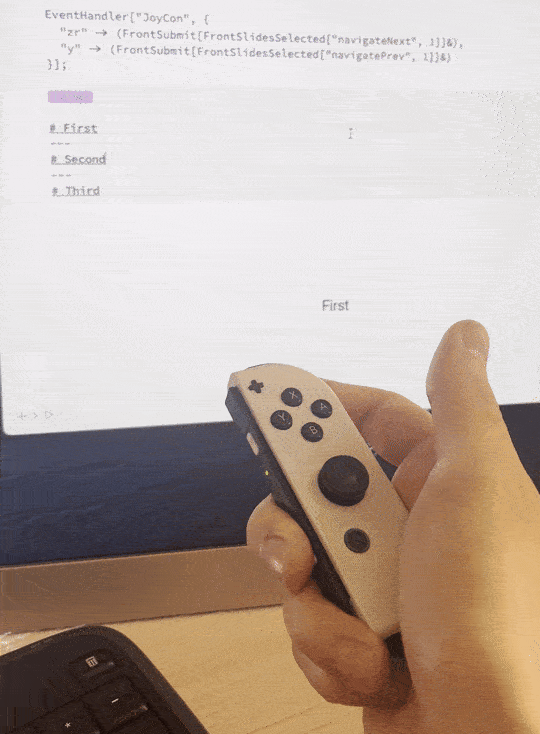
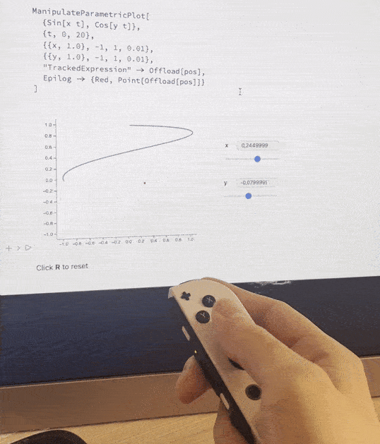

# JoyCon
Use Nintendo Switch controllers to move slides and trigger actions

<WLJSHTML>{`%3Cbr%20%2F%3E`}</WLJSHTML>

## Javascript
Here we use a library from NPM and bundle it right here.

:::note
__You do not need to build it by yourself__, WLJS Notebook stores assembled Javascript code in the output cell
:::

### How to build
Install NPM package locally

import { WLJSHTML, WLJSEditor, WLJSStore } from "@site/src/components/wljs-reactcells";

<WLJSStore json={require('./attachments/fe0cf21d-493c-495d-9e4a-c0ced0d83c6d.txt').default} notebook={require('./attachments/notebook-fe0.wln').default}/>

<WLJSEditor display={"codemirror"} nid={"fe0cf21d-493c-495d-9e4a-c0ced0d83c6d"} id={"1c81a793-a41a-403c-8329-6c8d433680e5"} type={"Input"} opts={{}} >{`.sh%0Anpm%20install%20joy-con-webhid%20--prefix%20.`}</WLJSEditor>

<WLJSEditor display={"shell"} nid={"fe0cf21d-493c-495d-9e4a-c0ced0d83c6d"} id={"440e7839-b248-4cb1-81e4-5185430e03c5"} type={"Output"} opts={{}} >{`%0Aadded%202%20packages%2C%20and%20audited%205%20packages%20in%204s%0A%0Afound%200%20vulnerabilities%0A`}</WLJSEditor>

Now we write a supportive Javascript code, which takes care about the initialization, joystick drift and pipes to even system of Wolfram Kernel.

<WLJSEditor display={"codemirror"} nid={"fe0cf21d-493c-495d-9e4a-c0ced0d83c6d"} id={"1d13020d-6743-4158-95e3-999e91577418"} type={"Input"} opts={{"Fade":true}} >{`.esm%0Aimport%20%7BconnectJoyCon%2C%20connectedJoyCons%7D%20from%20%27joy-con-webhid%27%3B%0A%0Aconst%20button%20%3D%20document.createElement%28%27button%27%29%3B%0Abutton.className%20%3D%20%27relative%20cursor-pointer%20rounded-md%200%20h-6%20pl-3%20pr-2%20text-left%20text-gray-500%20%20focus%3Aoutline-none%20ring-1%20sm%3Atext-xs%20sm%3Aleading-6%20bg-gray-100%27%3B%0Abutton.innerText%20%3D%20%22Connect%22%3B%0Alet%20state%20%3D%20%22Connect%22%3B%0A%0Alet%20joyConQ%20%3D%20false%3B%0A%0Alet%20timer%20%3D%20performance.now%28%29%3B%0Aconst%20buttons%20%3D%20%7B%0A%20%20a%3A%20false%2C%0A%20%20b%3A%20false%2C%0A%20%20home%3A%20false%2C%0A%20%20plus%3A%20false%2C%0A%20%20r%3A%20false%2C%0A%20%20sl%3A%20false%2C%0A%20%20sr%3A%20false%2C%0A%20%20x%3A%20false%2C%0A%20%20y%3A%20false%2C%0A%20%20zr%3A%20false%0A%7D%0A%0Aconst%20stick%20%3D%20%5B0.%2C0.%5D%3B%0Alet%20restingStick%20%3D%20%5B0.%2C0.%5D%3B%0Alet%20calibrated%20%3D%20false%3B%0A%0Aconst%20accelerometer%20%3D%20%5B0.0%2C0.0%2C0.0%5D%3B%0A%0Aconst%20interval%20%3D%20setInterval%28async%20%28%29%20%3D%3E%20%7B%0A%20%20const%20devices%20%3D%20connectedJoyCons.values%28%29%3B%0A%20%20joyConQ%20%3D%20false%3B%0A%20%20for%20%28const%20joyCon%20of%20devices%29%20%7B%0A%20%20%20%20joyConQ%20%3D%20true%3B%0A%20%20%20%20if%20%28joyCon.eventListenerAttached%29%20%7B%0A%20%20%20%20%20%20continue%3B%0A%20%20%20%20%7D%0A%20%20%20%20%2F%2F%20Open%20the%20device%20and%20enable%20standard%20full%20mode%20%0A%20%20%20%20await%20joyCon.open%28%29%3B%0A%20%20%20%20await%20joyCon.enableStandardFullMode%28%29%3B%0A%20%20%20%20%2F%2Fawait%20joyCon.enableIMUMode%28%29%3B%0A%20%20%20%20await%20joyCon.enableVibration%28%29%3B%0A%20%20%20%20%2F%2F%20Get%20information%20about%20the%20connected%20Joy-Con.%0A%20%20%20%20%2F%2Fconsole.log%28await%20joyCon.getDeviceInfo%28%29%29%3B%0A%20%20%20%20%2F%2F%20Rumble.%0A%20%20%20%20await%20joyCon.rumble%28600%2C%20600%2C%200.5%29%3B%0A%20%20%20%20%2F%2F%20Listen%20for%20HID%20input%20reports.%0A%20%20%20%20joyCon.addEventListener%28%27hidinput%27%2C%20%28%7B%20detail%20%7D%29%20%3D%3E%20%7B%0A%20%20%20%20%20%20%2F%2F%20Careful%2C%20this%20fires%20at%20~60fps.%0A%20%20%20%20%20%20if%20%28%21calibrated%29%20%7B%0A%20%20%20%20%20%20%20%20restingStick%20%3D%20%5BNumber%28detail.analogStickRight.horizontal%29%2C%20Number%28detail.analogStickRight.vertical%29%5D%0A%20%20%20%20%20%20%20%20calibrated%20%3D%20true%3B%0A%20%20%20%20%20%20%20%20return%3B%0A%20%20%20%20%20%20%7D%0A%20%20%20%20%20%20const%20time%20%3D%20performance.now%28%29%3B%0A%20%20%20%20%20%20if%20%28time%20-%20timer%20%3E%2050%29%20%7B%20%2F%2F%20reduce%20a%20bit%0A%20%20%20%20%20%20%20%20%20%20timer%20%3D%20time%3B%0A%20%20%20%20%20%20%20%20%0A%20%20%20%20%20%20%20%20%20%20let%20pressedQ%20%3D%20false%3B%0A%20%20%20%20%20%20%20%20%20%20let%20movedQ%20%3D%20false%3B%0A%20%20%20%20%20%20%20%20%20%20let%20acceleratedQ%20%3D%20false%3B%0A%20%20%20%20%20%20%20%20%0A%20%20%20%20%20%20%20%20%20%20for%20%28const%20key%20of%20Object.keys%28buttons%29%29%20%7B%0A%20%20%20%20%20%20%20%20%20%20%20%20if%20%28%21buttons%5Bkey%5D%20%26%26%20detail.buttonStatus%5Bkey%5D%29%20pressedQ%20%3D%20true%3B%0A%20%20%20%20%20%20%20%20%20%20%20%20buttons%5Bkey%5D%20%3D%20detail.buttonStatus%5Bkey%5D%3B%0A%20%20%20%20%20%20%20%20%20%20%7D%0A%0A%20%20%20%20%20%20%20%20%20%20const%20vertical%20%3D%20Number%28detail.analogStickRight.vertical%29%20%20-restingStick%5B1%5D%3B%0A%20%20%20%20%20%20%20%20%20%20const%20horizontal%20%3D%20Number%28detail.analogStickRight.horizontal%29%20-%20restingStick%5B0%5D%3B%0A%0A%20%20%20%20%20%20%20%20%20%20if%20%28Math.abs%28vertical%29%20%3E%200.1%29%20movedQ%20%3D%20true%3B%0A%20%20%20%20%20%20%20%20%20%20if%20%28Math.abs%28horizontal%29%20%3E%200.1%29%20movedQ%20%3D%20true%3B%0A%0A%20%20%20%20%20%20%20%20%20%20stick%5B1%5D%20%3D%20-vertical%3B%0A%20%20%20%20%20%20%20%20%20%20stick%5B0%5D%20%3D%20horizontal%3B%0A%0A%20%20%20%20%20%20%20%20%20%20%2F%2Fconst%20acceleration%20%3D%20detail.actualAccelerometer%3B%0A%0A%20%20%20%20%20%20%20%20%20%20%2F%2Fif%20%28Math.abs%28accelerometer%5B0%5D%20-%20acceleration.x%29%20%3E%200.001%29%20acceleratedQ%20%3D%20true%3B%0A%20%20%20%20%20%20%20%20%20%20%2F%2Fif%20%28Math.abs%28accelerometer%5B1%5D%20-%20acceleration.y%29%20%3E%200.001%29%20acceleratedQ%20%3D%20true%3B%0A%20%20%20%20%20%20%20%20%20%20%2F%2Fif%20%28Math.abs%28accelerometer%5B2%5D%20-%20acceleration.z%29%20%3E%200.001%29%20acceleratedQ%20%3D%20true%3B%0A%0A%20%20%20%20%20%20%20%20%20%20%2F%2Faccelerometer%5B0%5D%20%3D%20%20acceleration.x%3B%0A%20%20%20%20%20%20%20%20%20%20%2F%2Faccelerometer%5B1%5D%20%3D%20%20acceleration.y%3B%0A%20%20%20%20%20%20%20%20%20%20%2F%2Faccelerometer%5B2%5D%20%3D%20%20acceleration.z%3B%0A%0A%20%20%20%20%20%20%20%20%20%20if%20%28pressedQ%29%20%7B%0A%20%20%20%20%20%20%20%20%20%20%20%20for%20%28const%20key%20of%20Object.keys%28buttons%29%29%20%7B%0A%20%20%20%20%20%20%20%20%20%20%20%20%20%20if%20%28buttons%5Bkey%5D%29%20%7B%0A%20%20%20%20%20%20%20%20%20%20%20%20%20%20%20%20server.kernel.io.fire%28%27JoyCon%27%2C%20true%2C%20key%29%3B%0A%20%20%20%20%20%20%20%20%20%20%20%20%20%20%20%20break%3B%0A%20%20%20%20%20%20%20%20%20%20%20%20%20%20%7D%0A%20%20%20%20%20%20%20%20%20%20%20%20%7D%0A%20%20%20%20%20%20%20%20%20%20%7D%0A%0A%20%20%20%20%20%20%20%20%20if%20%28movedQ%29%20%7B%0A%20%20%20%20%20%20%20%20%20%20%20%20server.kernel.io.fire%28%27JoyCon%27%2C%20stick%2C%20%27Stick%27%29%3B%0A%20%20%20%20%20%20%20%20%20%7D%0A%0A%20%20%20%20%20%20%20%20%20%2F%2Fif%20%28acceleratedQ%29%20%7B%0A%20%20%20%20%20%20%20%20%20%20%20%20%2F%2Fserver.kernel.io.fire%28%27JoyCon%27%2C%20accelerometer%2C%20%27Acceleration%27%29%3B%0A%20%20%20%20%20%20%20%20%20%2F%2F%7D%0A%20%20%20%20%20%20%7D%3B%0A%20%20%20%20%7D%29%3B%0A%20%20%20%20joyCon.eventListenerAttached%20%3D%20true%3B%0A%20%20%7D%0A%0A%20%20if%20%28joyConQ%29%20%7B%0A%20%20%20%20if%20%28state%20%21%3D%20%22Connected%22%29%20%7B%0A%20%20%20%20%20%20state%20%3D%20%22Connected%22%3B%0A%20%20%20%20%20%20button.innerText%3Dstate%3B%0A%20%20%20%20%20%20button.style.background%20%3D%20%27%23d8ffd8%27%3B%0A%20%20%20%20%7D%0A%20%20%7D%20else%20%7B%0A%20%20%20%20if%20%28state%20%21%3D%20%22Connect%22%29%20%7B%0A%20%20%20%20%20%20state%20%3D%20%22Connect%22%3B%0A%20%20%20%20%20%20button.innerText%3Dstate%3B%0A%20%20%20%20%20%20button.style.background%20%3D%20%27%27%3B%0A%20%20%20%20%7D%0A%20%20%7D%0A%7D%2C%202000%29%3B%0A%0Abutton.addEventListener%28%27click%27%2C%20async%20%28%29%20%3D%3E%20%7B%0A%20%20%2F%2F%20%60JoyCon.connectJoyCon%28%29%60%20handles%20the%20initial%20HID%20pairing.%0A%20%20if%20%28%21joyConQ%29%20%7B%0A%20%20%20%20await%20connectJoyCon%28%29%3B%0A%20%20%20%20return%3B%0A%20%20%7D%0A%0A%7D%29%3B%0A%0Athis.return%28button%29%3B%0A%0Athis.ondestroy%28%28%29%20%3D%3E%20%7B%0A%20%20cancelInterval%28interval%29%3B%0A%7D%29`}</WLJSEditor>

<WLJSEditor display={"esm"} nid={"fe0cf21d-493c-495d-9e4a-c0ced0d83c6d"} id={"3a0a31da-40db-49e1-90be-7f2b3bcac474"} type={"Output"} opts={{}} >{`%2F%2F%20node_modules%2Fjoy-con-webhid%2Fdist%2Fmadgwick.js%0Afunction%20Madgwick%28sampleInterval%2C%20options%29%20%7B%0A%20%20options%20%3D%20options%20%7C%7C%20%7B%7D%3B%0A%20%20const%20sampleFreq%20%3D%201e3%20%2F%20sampleInterval%3B%0A%20%20let%20beta%20%3D%20options.beta%20%7C%7C%200.4%3B%0A%20%20let%20initalised%20%3D%20options.doInitialisation%20%3D%3D%3D%20true%20%3F%20false%20%3A%20true%3B%0A%20%20let%20q0%20%3D%201%2C%20q1%20%3D%200%2C%20q2%20%3D%200%2C%20q3%20%3D%200%3B%0A%20%20let%20recipSampleFreq%20%3D%201%20%2F%20sampleFreq%3B%0A%20%20function%20madgwickAHRSUpdateIMU%28gx%2C%20gy%2C%20gz%2C%20ax%2C%20ay%2C%20az%29%20%7B%0A%20%20%20%20let%20recipNorm%3B%0A%20%20%20%20let%20s0%2C%20s1%2C%20s2%2C%20s3%3B%0A%20%20%20%20let%20qDot1%2C%20qDot2%2C%20qDot3%2C%20qDot4%3B%0A%20%20%20%20let%20v2q0%2C%20v2q1%2C%20v2q2%2C%20v2q3%2C%20v4q0%2C%20v4q1%2C%20v4q2%2C%20v8q1%2C%20v8q2%2C%20q0q0%2C%20q1q1%2C%20q2q2%2C%20q3q3%3B%0A%20%20%20%20qDot1%20%3D%200.5%20%2A%20%28-q1%20%2A%20gx%20-%20q2%20%2A%20gy%20-%20q3%20%2A%20gz%29%3B%0A%20%20%20%20qDot2%20%3D%200.5%20%2A%20%28q0%20%2A%20gx%20%2B%20q2%20%2A%20gz%20-%20q3%20%2A%20gy%29%3B%0A%20%20%20%20qDot3%20%3D%200.5%20%2A%20%28q0%20%2A%20gy%20-%20q1%20%2A%20gz%20%2B%20q3%20%2A%20gx%29%3B%0A%20%20%20%20qDot4%20%3D%200.5%20%2A%20%28q0%20%2A%20gz%20%2B%20q1%20%2A%20gy%20-%20q2%20%2A%20gx%29%3B%0A%20%20%20%20if%20%28%21%28ax%20%3D%3D%3D%200%20%26%26%20ay%20%3D%3D%3D%200%20%26%26%20az%20%3D%3D%3D%200%29%29%20%7B%0A%20%20%20%20%20%20recipNorm%20%3D%20%28ax%20%2A%20ax%20%2B%20ay%20%2A%20ay%20%2B%20az%20%2A%20az%29%20%2A%2A%20-0.5%3B%0A%20%20%20%20%20%20ax%20%2A%3D%20recipNorm%3B%0A%20%20%20%20%20%20ay%20%2A%3D%20recipNorm%3B%0A%20%20%20%20%20%20az%20%2A%3D%20recipNorm%3B%0A%20%20%20%20%20%20v2q0%20%3D%202%20%2A%20q0%3B%0A%20%20%20%20%20%20v2q1%20%3D%202%20%2A%20q1%3B%0A%20%20%20%20%20%20v2q2%20%3D%202%20%2A%20q2%3B%0A%20%20%20%20%20%20v2q3%20%3D%202%20%2A%20q3%3B%0A%20%20%20%20%20%20v4q0%20%3D%204%20%2A%20q0%3B%0A%20%20%20%20%20%20v4q1%20%3D%204%20%2A%20q1%3B%0A%20%20%20%20%20%20v4q2%20%3D%204%20%2A%20q2%3B%0A%20%20%20%20%20%20v8q1%20%3D%208%20%2A%20q1%3B%0A%20%20%20%20%20%20v8q2%20%3D%208%20%2A%20q2%3B%0A%20%20%20%20%20%20q0q0%20%3D%20q0%20%2A%20q0%3B%0A%20%20%20%20%20%20q1q1%20%3D%20q1%20%2A%20q1%3B%0A%20%20%20%20%20%20q2q2%20%3D%20q2%20%2A%20q2%3B%0A%20%20%20%20%20%20q3q3%20%3D%20q3%20%2A%20q3%3B%0A%20%20%20%20%20%20s0%20%3D%20v4q0%20%2A%20q2q2%20%2B%20v2q2%20%2A%20ax%20%2B%20v4q0%20%2A%20q1q1%20-%20v2q1%20%2A%20ay%3B%0A%20%20%20%20%20%20s1%20%3D%20v4q1%20%2A%20q3q3%20-%20v2q3%20%2A%20ax%20%2B%204%20%2A%20q0q0%20%2A%20q1%20-%20v2q0%20%2A%20ay%20-%20v4q1%20%2B%20v8q1%20%2A%20q1q1%20%2B%20v8q1%20%2A%20q2q2%20%2B%20v4q1%20%2A%20az%3B%0A%20%20%20%20%20%20s2%20%3D%204%20%2A%20q0q0%20%2A%20q2%20%2B%20v2q0%20%2A%20ax%20%2B%20v4q2%20%2A%20q3q3%20-%20v2q3%20%2A%20ay%20-%20v4q2%20%2B%20v8q2%20%2A%20q1q1%20%2B%20v8q2%20%2A%20q2q2%20%2B%20v4q2%20%2A%20az%3B%0A%20%20%20%20%20%20s3%20%3D%204%20%2A%20q1q1%20%2A%20q3%20-%20v2q1%20%2A%20ax%20%2B%204%20%2A%20q2q2%20%2A%20q3%20-%20v2q2%20%2A%20ay%3B%0A%20%20%20%20%20%20recipNorm%20%3D%20%28s0%20%2A%20s0%20%2B%20s1%20%2A%20s1%20%2B%20s2%20%2A%20s2%20%2B%20s3%20%2A%20s3%29%20%2A%2A%20-0.5%3B%0A%20%20%20%20%20%20s0%20%2A%3D%20recipNorm%3B%0A%20%20%20%20%20%20s1%20%2A%3D%20recipNorm%3B%0A%20%20%20%20%20%20s2%20%2A%3D%20recipNorm%3B%0A%20%20%20%20%20%20s3%20%2A%3D%20recipNorm%3B%0A%20%20%20%20%20%20qDot1%20-%3D%20beta%20%2A%20s0%3B%0A%20%20%20%20%20%20qDot2%20-%3D%20beta%20%2A%20s1%3B%0A%20%20%20%20%20%20qDot3%20-%3D%20beta%20%2A%20s2%3B%0A%20%20%20%20%20%20qDot4%20-%3D%20beta%20%2A%20s3%3B%0A%20%20%20%20%7D%0A%20%20%20%20q0%20%2B%3D%20qDot1%20%2A%20recipSampleFreq%3B%0A%20%20%20%20q1%20%2B%3D%20qDot2%20%2A%20recipSampleFreq%3B%0A%20%20%20%20q2%20%2B%3D%20qDot3%20%2A%20recipSampleFreq%3B%0A%20%20%20%20q3%20%2B%3D%20qDot4%20%2A%20recipSampleFreq%3B%0A%20%20%20%20recipNorm%20%3D%20%28q0%20%2A%20q0%20%2B%20q1%20%2A%20q1%20%2B%20q2%20%2A%20q2%20%2B%20q3%20%2A%20q3%29%20%2A%2A%20-0.5%3B%0A%20%20%20%20q0%20%2A%3D%20recipNorm%3B%0A%20%20%20%20q1%20%2A%3D%20recipNorm%3B%0A%20%20%20%20q2%20%2A%3D%20recipNorm%3B%0A%20%20%20%20q3%20%2A%3D%20recipNorm%3B%0A%20%20%7D%0A%20%20function%20cross_product%28ax%2C%20ay%2C%20az%2C%20bx%2C%20by%2C%20bz%29%20%7B%0A%20%20%20%20return%20%7B%20x%3A%20ay%20%2A%20bz%20-%20az%20%2A%20by%2C%20y%3A%20az%20%2A%20bx%20-%20ax%20%2A%20bz%2C%20z%3A%20ax%20%2A%20by%20-%20ay%20%2A%20bx%20%7D%3B%0A%20%20%7D%0A%20%20function%20eulerAnglesFromImuRad%28ax%2C%20ay%2C%20az%2C%20mx%2C%20my%2C%20mz%29%20%7B%0A%20%20%20%20const%20pitch%20%3D%20-Math.atan2%28ax%2C%20Math.sqrt%28ay%20%2A%20ay%20%2B%20az%20%2A%20az%29%29%3B%0A%20%20%20%20const%20tmp1%20%3D%20cross_product%28ax%2C%20ay%2C%20az%2C%201%2C%200%2C%200%29%3B%0A%20%20%20%20const%20tmp2%20%3D%20cross_product%281%2C%200%2C%200%2C%20tmp1.x%2C%20tmp1.y%2C%20tmp1.z%29%3B%0A%20%20%20%20const%20roll%20%3D%20Math.atan2%28tmp2.y%2C%20tmp2.z%29%3B%0A%20%20%20%20const%20cr%20%3D%20Math.cos%28roll%29%3B%0A%20%20%20%20const%20sp%20%3D%20Math.sin%28pitch%29%3B%0A%20%20%20%20const%20sr%20%3D%20Math.sin%28roll%29%3B%0A%20%20%20%20const%20yh%20%3D%20my%20%2A%20cr%20-%20mz%20%2A%20sr%3B%0A%20%20%20%20const%20xh%20%3D%20mx%20%2A%20Math.cos%28pitch%29%20%2B%20my%20%2A%20sr%20%2A%20sp%20%2B%20mz%20%2A%20cr%20%2A%20sp%3B%0A%20%20%20%20const%20heading%20%3D%20-Math.atan2%28yh%2C%20xh%29%3B%0A%20%20%20%20return%20%7B%20heading%2C%20pitch%2C%20roll%20%7D%3B%0A%20%20%7D%0A%20%20function%20toQuaternion2%28eulerAngles%29%20%7B%0A%20%20%20%20const%20cy%20%3D%20Math.cos%28eulerAngles.heading%20%2A%200.5%29%3B%0A%20%20%20%20const%20sy%20%3D%20Math.sin%28eulerAngles.heading%20%2A%200.5%29%3B%0A%20%20%20%20const%20cp%20%3D%20Math.cos%28eulerAngles.pitch%20%2A%200.5%29%3B%0A%20%20%20%20const%20sp%20%3D%20Math.sin%28eulerAngles.pitch%20%2A%200.5%29%3B%0A%20%20%20%20const%20cr%20%3D%20Math.cos%28eulerAngles.roll%20%2A%200.5%29%3B%0A%20%20%20%20const%20sr%20%3D%20Math.sin%28eulerAngles.roll%20%2A%200.5%29%3B%0A%20%20%20%20return%20%7B%20w%3A%20cr%20%2A%20cp%20%2A%20cy%20%2B%20sr%20%2A%20sp%20%2A%20sy%2C%20x%3A%20sr%20%2A%20cp%20%2A%20cy%20-%20cr%20%2A%20sp%20%2A%20sy%2C%20y%3A%20cr%20%2A%20sp%20%2A%20cy%20%2B%20sr%20%2A%20cp%20%2A%20sy%2C%20z%3A%20cr%20%2A%20cp%20%2A%20sy%20-%20sr%20%2A%20sp%20%2A%20cy%20%7D%3B%0A%20%20%7D%0A%20%20function%20init%28ax%2C%20ay%2C%20az%2C%20mx%2C%20my%2C%20mz%29%20%7B%0A%20%20%20%20const%20ea%20%3D%20eulerAnglesFromImuRad%28ax%2C%20ay%2C%20az%2C%20mx%2C%20my%2C%20mz%29%3B%0A%20%20%20%20const%20iq%20%3D%20toQuaternion2%28ea%29%3B%0A%20%20%20%20const%20recipNorm%20%3D%20%28iq.w%20%2A%20iq.w%20%2B%20iq.x%20%2A%20iq.x%20%2B%20iq.y%20%2A%20iq.y%20%2B%20iq.z%20%2A%20iq.z%29%20%2A%2A%20-0.5%3B%0A%20%20%20%20q0%20%3D%20iq.w%20%2A%20recipNorm%3B%0A%20%20%20%20q1%20%3D%20iq.x%20%2A%20recipNorm%3B%0A%20%20%20%20q2%20%3D%20iq.y%20%2A%20recipNorm%3B%0A%20%20%20%20q3%20%3D%20iq.z%20%2A%20recipNorm%3B%0A%20%20%20%20initalised%20%3D%20true%3B%0A%20%20%7D%0A%20%20function%20madgwickAHRSUpdate%28gx%2C%20gy%2C%20gz%2C%20ax%2C%20ay%2C%20az%2C%20mx%2C%20my%2C%20mz%2C%20deltaTimeSec%29%20%7B%0A%20%20%20%20recipSampleFreq%20%3D%20deltaTimeSec%20%7C%7C%20recipSampleFreq%3B%0A%20%20%20%20if%20%28%21initalised%29%20%7B%0A%20%20%20%20%20%20init%28ax%2C%20ay%2C%20az%2C%20mx%2C%20my%2C%20mz%29%3B%0A%20%20%20%20%7D%0A%20%20%20%20let%20recipNorm%3B%0A%20%20%20%20let%20s0%2C%20s1%2C%20s2%2C%20s3%3B%0A%20%20%20%20let%20qDot1%2C%20qDot2%2C%20qDot3%2C%20qDot4%3B%0A%20%20%20%20let%20hx%2C%20hy%3B%0A%20%20%20%20let%20v2q0mx%2C%20v2q0my%2C%20v2q0mz%2C%20v2q1mx%2C%20v2bx%2C%20v2bz%2C%20v4bx%2C%20v4bz%2C%20v2q0%2C%20v2q1%2C%20v2q2%2C%20v2q3%2C%20v2q0q2%2C%20v2q2q3%3B%0A%20%20%20%20let%20q0q0%2C%20q0q1%2C%20q0q2%2C%20q0q3%2C%20q1q1%2C%20q1q2%2C%20q1q3%2C%20q2q2%2C%20q2q3%2C%20q3q3%3B%0A%20%20%20%20if%20%28mx%20%3D%3D%3D%20void%200%20%7C%7C%20my%20%3D%3D%3D%20void%200%20%7C%7C%20mz%20%3D%3D%3D%20void%200%20%7C%7C%20mx%20%3D%3D%3D%200%20%26%26%20my%20%3D%3D%3D%200%20%26%26%20mz%20%3D%3D%3D%200%29%20%7B%0A%20%20%20%20%20%20madgwickAHRSUpdateIMU%28gx%2C%20gy%2C%20gz%2C%20ax%2C%20ay%2C%20az%29%3B%0A%20%20%20%20%20%20return%3B%0A%20%20%20%20%7D%0A%20%20%20%20qDot1%20%3D%200.5%20%2A%20%28-q1%20%2A%20gx%20-%20q2%20%2A%20gy%20-%20q3%20%2A%20gz%29%3B%0A%20%20%20%20qDot2%20%3D%200.5%20%2A%20%28q0%20%2A%20gx%20%2B%20q2%20%2A%20gz%20-%20q3%20%2A%20gy%29%3B%0A%20%20%20%20qDot3%20%3D%200.5%20%2A%20%28q0%20%2A%20gy%20-%20q1%20%2A%20gz%20%2B%20q3%20%2A%20gx%29%3B%0A%20%20%20%20qDot4%20%3D%200.5%20%2A%20%28q0%20%2A%20gz%20%2B%20q1%20%2A%20gy%20-%20q2%20%2A%20gx%29%3B%0A%20%20%20%20if%20%28%21%28ax%20%3D%3D%3D%200%20%26%26%20ay%20%3D%3D%3D%200%20%26%26%20az%20%3D%3D%3D%200%29%29%20%7B%0A%20%20%20%20%20%20recipNorm%20%3D%20%28ax%20%2A%20ax%20%2B%20ay%20%2A%20ay%20%2B%20az%20%2A%20az%29%20%2A%2A%20-0.5%3B%0A%20%20%20%20%20%20ax%20%2A%3D%20recipNorm%3B%0A%20%20%20%20%20%20ay%20%2A%3D%20recipNorm%3B%0A%20%20%20%20%20%20az%20%2A%3D%20recipNorm%3B%0A%20%20%20%20%20%20recipNorm%20%3D%20%28mx%20%2A%20mx%20%2B%20my%20%2A%20my%20%2B%20mz%20%2A%20mz%29%20%2A%2A%20-0.5%3B%0A%20%20%20%20%20%20mx%20%2A%3D%20recipNorm%3B%0A%20%20%20%20%20%20my%20%2A%3D%20recipNorm%3B%0A%20%20%20%20%20%20mz%20%2A%3D%20recipNorm%3B%0A%20%20%20%20%20%20v2q0mx%20%3D%202%20%2A%20q0%20%2A%20mx%3B%0A%20%20%20%20%20%20v2q0my%20%3D%202%20%2A%20q0%20%2A%20my%3B%0A%20%20%20%20%20%20v2q0mz%20%3D%202%20%2A%20q0%20%2A%20mz%3B%0A%20%20%20%20%20%20v2q1mx%20%3D%202%20%2A%20q1%20%2A%20mx%3B%0A%20%20%20%20%20%20v2q0%20%3D%202%20%2A%20q0%3B%0A%20%20%20%20%20%20v2q1%20%3D%202%20%2A%20q1%3B%0A%20%20%20%20%20%20v2q2%20%3D%202%20%2A%20q2%3B%0A%20%20%20%20%20%20v2q3%20%3D%202%20%2A%20q3%3B%0A%20%20%20%20%20%20v2q0q2%20%3D%202%20%2A%20q0%20%2A%20q2%3B%0A%20%20%20%20%20%20v2q2q3%20%3D%202%20%2A%20q2%20%2A%20q3%3B%0A%20%20%20%20%20%20q0q0%20%3D%20q0%20%2A%20q0%3B%0A%20%20%20%20%20%20q0q1%20%3D%20q0%20%2A%20q1%3B%0A%20%20%20%20%20%20q0q2%20%3D%20q0%20%2A%20q2%3B%0A%20%20%20%20%20%20q0q3%20%3D%20q0%20%2A%20q3%3B%0A%20%20%20%20%20%20q1q1%20%3D%20q1%20%2A%20q1%3B%0A%20%20%20%20%20%20q1q2%20%3D%20q1%20%2A%20q2%3B%0A%20%20%20%20%20%20q1q3%20%3D%20q1%20%2A%20q3%3B%0A%20%20%20%20%20%20q2q2%20%3D%20q2%20%2A%20q2%3B%0A%20%20%20%20%20%20q2q3%20%3D%20q2%20%2A%20q3%3B%0A%20%20%20%20%20%20q3q3%20%3D%20q3%20%2A%20q3%3B%0A%20%20%20%20%20%20hx%20%3D%20mx%20%2A%20q0q0%20-%20v2q0my%20%2A%20q3%20%2B%20v2q0mz%20%2A%20q2%20%2B%20mx%20%2A%20q1q1%20%2B%20v2q1%20%2A%20my%20%2A%20q2%20%2B%20v2q1%20%2A%20mz%20%2A%20q3%20-%20mx%20%2A%20q2q2%20-%20mx%20%2A%20q3q3%3B%0A%20%20%20%20%20%20hy%20%3D%20v2q0mx%20%2A%20q3%20%2B%20my%20%2A%20q0q0%20-%20v2q0mz%20%2A%20q1%20%2B%20v2q1mx%20%2A%20q2%20-%20my%20%2A%20q1q1%20%2B%20my%20%2A%20q2q2%20%2B%20v2q2%20%2A%20mz%20%2A%20q3%20-%20my%20%2A%20q3q3%3B%0A%20%20%20%20%20%20v2bx%20%3D%20Math.sqrt%28hx%20%2A%20hx%20%2B%20hy%20%2A%20hy%29%3B%0A%20%20%20%20%20%20v2bz%20%3D%20-v2q0mx%20%2A%20q2%20%2B%20v2q0my%20%2A%20q1%20%2B%20mz%20%2A%20q0q0%20%2B%20v2q1mx%20%2A%20q3%20-%20mz%20%2A%20q1q1%20%2B%20v2q2%20%2A%20my%20%2A%20q3%20-%20mz%20%2A%20q2q2%20%2B%20mz%20%2A%20q3q3%3B%0A%20%20%20%20%20%20v4bx%20%3D%202%20%2A%20v2bx%3B%0A%20%20%20%20%20%20v4bz%20%3D%202%20%2A%20v2bz%3B%0A%20%20%20%20%20%20s0%20%3D%20-v2q2%20%2A%20%282%20%2A%20q1q3%20-%20v2q0q2%20-%20ax%29%20%2B%20v2q1%20%2A%20%282%20%2A%20q0q1%20%2B%20v2q2q3%20-%20ay%29%20-%20v2bz%20%2A%20q2%20%2A%20%28v2bx%20%2A%20%280.5%20-%20q2q2%20-%20q3q3%29%20%2B%20v2bz%20%2A%20%28q1q3%20-%20q0q2%29%20-%20mx%29%20%2B%20%28-v2bx%20%2A%20q3%20%2B%20v2bz%20%2A%20q1%29%20%2A%20%28v2bx%20%2A%20%28q1q2%20-%20q0q3%29%20%2B%20v2bz%20%2A%20%28q0q1%20%2B%20q2q3%29%20-%20my%29%20%2B%20v2bx%20%2A%20q2%20%2A%20%28v2bx%20%2A%20%28q0q2%20%2B%20q1q3%29%20%2B%20v2bz%20%2A%20%280.5%20-%20q1q1%20-%20q2q2%29%20-%20mz%29%3B%0A%20%20%20%20%20%20s1%20%3D%20v2q3%20%2A%20%282%20%2A%20q1q3%20-%20v2q0q2%20-%20ax%29%20%2B%20v2q0%20%2A%20%282%20%2A%20q0q1%20%2B%20v2q2q3%20-%20ay%29%20-%204%20%2A%20q1%20%2A%20%281%20-%202%20%2A%20q1q1%20-%202%20%2A%20q2q2%20-%20az%29%20%2B%20v2bz%20%2A%20q3%20%2A%20%28v2bx%20%2A%20%280.5%20-%20q2q2%20-%20q3q3%29%20%2B%20v2bz%20%2A%20%28q1q3%20-%20q0q2%29%20-%20mx%29%20%2B%20%28v2bx%20%2A%20q2%20%2B%20v2bz%20%2A%20q0%29%20%2A%20%28v2bx%20%2A%20%28q1q2%20-%20q0q3%29%20%2B%20v2bz%20%2A%20%28q0q1%20%2B%20q2q3%29%20-%20my%29%20%2B%20%28v2bx%20%2A%20q3%20-%20v4bz%20%2A%20q1%29%20%2A%20%28v2bx%20%2A%20%28q0q2%20%2B%20q1q3%29%20%2B%20v2bz%20%2A%20%280.5%20-%20q1q1%20-%20q2q2%29%20-%20mz%29%3B%0A%20%20%20%20%20%20s2%20%3D%20-v2q0%20%2A%20%282%20%2A%20q1q3%20-%20v2q0q2%20-%20ax%29%20%2B%20v2q3%20%2A%20%282%20%2A%20q0q1%20%2B%20v2q2q3%20-%20ay%29%20-%204%20%2A%20q2%20%2A%20%281%20-%202%20%2A%20q1q1%20-%202%20%2A%20q2q2%20-%20az%29%20%2B%20%28-v4bx%20%2A%20q2%20-%20v2bz%20%2A%20q0%29%20%2A%20%28v2bx%20%2A%20%280.5%20-%20q2q2%20-%20q3q3%29%20%2B%20v2bz%20%2A%20%28q1q3%20-%20q0q2%29%20-%20mx%29%20%2B%20%28v2bx%20%2A%20q1%20%2B%20v2bz%20%2A%20q3%29%20%2A%20%28v2bx%20%2A%20%28q1q2%20-%20q0q3%29%20%2B%20v2bz%20%2A%20%28q0q1%20%2B%20q2q3%29%20-%20my%29%20%2B%20%28v2bx%20%2A%20q0%20-%20v4bz%20%2A%20q2%29%20%2A%20%28v2bx%20%2A%20%28q0q2%20%2B%20q1q3%29%20%2B%20v2bz%20%2A%20%280.5%20-%20q1q1%20-%20q2q2%29%20-%20mz%29%3B%0A%20%20%20%20%20%20s3%20%3D%20v2q1%20%2A%20%282%20%2A%20q1q3%20-%20v2q0q2%20-%20ax%29%20%2B%20v2q2%20%2A%20%282%20%2A%20q0q1%20%2B%20v2q2q3%20-%20ay%29%20%2B%20%28-v4bx%20%2A%20q3%20%2B%20v2bz%20%2A%20q1%29%20%2A%20%28v2bx%20%2A%20%280.5%20-%20q2q2%20-%20q3q3%29%20%2B%20v2bz%20%2A%20%28q1q3%20-%20q0q2%29%20-%20mx%29%20%2B%20%28-v2bx%20%2A%20q0%20%2B%20v2bz%20%2A%20q2%29%20%2A%20%28v2bx%20%2A%20%28q1q2%20-%20q0q3%29%20%2B%20v2bz%20%2A%20%28q0q1%20%2B%20q2q3%29%20-%20my%29%20%2B%20v2bx%20%2A%20q1%20%2A%20%28v2bx%20%2A%20%28q0q2%20%2B%20q1q3%29%20%2B%20v2bz%20%2A%20%280.5%20-%20q1q1%20-%20q2q2%29%20-%20mz%29%3B%0A%20%20%20%20%20%20recipNorm%20%3D%20%28s0%20%2A%20s0%20%2B%20s1%20%2A%20s1%20%2B%20s2%20%2A%20s2%20%2B%20s3%20%2A%20s3%29%20%2A%2A%20-0.5%3B%0A%20%20%20%20%20%20s0%20%2A%3D%20recipNorm%3B%0A%20%20%20%20%20%20s1%20%2A%3D%20recipNorm%3B%0A%20%20%20%20%20%20s2%20%2A%3D%20recipNorm%3B%0A%20%20%20%20%20%20s3%20%2A%3D%20recipNorm%3B%0A%20%20%20%20%20%20qDot1%20-%3D%20beta%20%2A%20s0%3B%0A%20%20%20%20%20%20qDot2%20-%3D%20beta%20%2A%20s1%3B%0A%20%20%20%20%20%20qDot3%20-%3D%20beta%20%2A%20s2%3B%0A%20%20%20%20%20%20qDot4%20-%3D%20beta%20%2A%20s3%3B%0A%20%20%20%20%7D%0A%20%20%20%20q0%20%2B%3D%20qDot1%20%2A%20recipSampleFreq%3B%0A%20%20%20%20q1%20%2B%3D%20qDot2%20%2A%20recipSampleFreq%3B%0A%20%20%20%20q2%20%2B%3D%20qDot3%20%2A%20recipSampleFreq%3B%0A%20%20%20%20q3%20%2B%3D%20qDot4%20%2A%20recipSampleFreq%3B%0A%20%20%20%20recipNorm%20%3D%20%28q0%20%2A%20q0%20%2B%20q1%20%2A%20q1%20%2B%20q2%20%2A%20q2%20%2B%20q3%20%2A%20q3%29%20%2A%2A%20-0.5%3B%0A%20%20%20%20q0%20%2A%3D%20recipNorm%3B%0A%20%20%20%20q1%20%2A%3D%20recipNorm%3B%0A%20%20%20%20q2%20%2A%3D%20recipNorm%3B%0A%20%20%20%20q3%20%2A%3D%20recipNorm%3B%0A%20%20%7D%0A%20%20return%20%7B%20update%3A%20madgwickAHRSUpdate%2C%20init%2C%20getQuaternion%28%29%20%7B%0A%20%20%20%20return%20%7B%20w%3A%20q0%2C%20x%3A%20q1%2C%20y%3A%20q2%2C%20z%3A%20q3%20%7D%3B%0A%20%20%7D%20%7D%3B%0A%7D%0A%0A%2F%2F%20node_modules%2Fjoy-con-webhid%2Fdist%2Fparse.js%0Avar%20leftMadgwick%20%3D%20new%20Madgwick%2810%29%3B%0Avar%20rightMadgwick%20%3D%20new%20Madgwick%2810%29%3B%0Avar%20rad2deg%20%3D%20180%20%2F%20Math.PI%3B%0Afunction%20baseSum%28array%2C%20iteratee%29%20%7B%0A%20%20let%20result%3B%0A%20%20for%20%28const%20value%20of%20array%29%20%7B%0A%20%20%20%20const%20current%20%3D%20iteratee%28value%29%3B%0A%20%20%20%20if%20%28current%20%21%3D%3D%20void%200%29%20%7B%0A%20%20%20%20%20%20result%20%3D%20result%20%3D%3D%3D%20void%200%20%3F%20current%20%3A%20result%20%2B%20current%3B%0A%20%20%20%20%7D%0A%20%20%7D%0A%20%20return%20result%3B%0A%7D%0Afunction%20mean%28array%29%20%7B%0A%20%20return%20baseMean%28array%2C%20%28value%29%20%3D%3E%20value%29%3B%0A%7D%0Afunction%20baseMean%28array%2C%20iteratee%29%20%7B%0A%20%20const%20length%20%3D%20array%20%3D%3D%20null%20%3F%200%20%3A%20array.length%3B%0A%20%20return%20length%20%3F%20baseSum%28array%2C%20iteratee%29%20%2F%20length%20%3A%20NaN%3B%0A%7D%0Afunction%20calculateBatteryLevel%28value%29%20%7B%0A%20%20let%20level%3B%0A%20%20switch%20%28value%5B0%5D%29%20%7B%0A%20%20%20%20case%208%3A%0A%20%20%20%20%20%20level%20%3D%20%22full%22%3B%0A%20%20%20%20%20%20break%3B%0A%20%20%20%20case%204%3A%0A%20%20%20%20%20%20level%20%3D%20%22medium%22%3B%0A%20%20%20%20%20%20break%3B%0A%20%20%20%20case%202%3A%0A%20%20%20%20%20%20level%20%3D%20%22low%22%3B%0A%20%20%20%20%20%20break%3B%0A%20%20%20%20case%201%3A%0A%20%20%20%20%20%20level%20%3D%20%22critical%22%3B%0A%20%20%20%20%20%20break%3B%0A%20%20%20%20case%200%3A%0A%20%20%20%20%20%20level%20%3D%20%22empty%22%3B%0A%20%20%20%20%20%20break%3B%0A%20%20%20%20default%3A%0A%20%20%20%20%20%20level%20%3D%20%22charging%22%3B%0A%20%20%7D%0A%20%20return%20level%3B%0A%7D%0Avar%20ControllerType%20%3D%20%7B%201%3A%20%22Left%20Joy-Con%22%2C%202%3A%20%22Right%20Joy-Con%22%2C%203%3A%20%22Pro%20Controller%22%20%7D%3B%0Avar%20bias%20%3D%200.75%3B%0Avar%20zeroBias%20%3D%200.0125%3B%0Avar%20scale%20%3D%20Math.PI%20%2F%202%3B%0Afunction%20toEulerAngles%28lastValues%2C%20gyroscope%2C%20accelerometer%2C%20productId%29%20%7B%0A%20%20const%20now%20%3D%20Date.now%28%29%3B%0A%20%20const%20dt%20%3D%20lastValues.timestamp%20%3F%20%28now%20-%20lastValues.timestamp%29%20%2F%201e3%20%3A%200%3B%0A%20%20lastValues.timestamp%20%3D%20now%3B%0A%20%20const%20norm%20%3D%20Math.sqrt%28accelerometer.x%20%2A%2A%202%20%2B%20accelerometer.y%20%2A%2A%202%20%2B%20accelerometer.z%20%2A%2A%202%29%3B%0A%20%20lastValues.alpha%20%3D%20%281%20-%20zeroBias%29%20%2A%20%28lastValues.alpha%20%2B%20gyroscope.z%20%2A%20dt%29%3B%0A%20%20if%20%28norm%20%21%3D%3D%200%29%20%7B%0A%20%20%20%20lastValues.beta%20%3D%20bias%20%2A%20%28lastValues.beta%20%2B%20gyroscope.x%20%2A%20dt%29%20%2B%20%281%20-%20bias%29%20%2A%20%28accelerometer.x%20%2A%20scale%20%2F%20norm%29%3B%0A%20%20%20%20lastValues.gamma%20%3D%20bias%20%2A%20%28lastValues.gamma%20%2B%20gyroscope.y%20%2A%20dt%29%20%2B%20%281%20-%20bias%29%20%2A%20%28accelerometer.y%20%2A%20-scale%20%2F%20norm%29%3B%0A%20%20%7D%0A%20%20return%20%7B%20alpha%3A%20productId%20%3D%3D%3D%208198%20%3F%20%28-1%20%2A%20%28lastValues.alpha%20%2A%20180%29%20%2F%20Math.PI%20%2A%20430%20%25%2090%29.toFixed%286%29%20%3A%20%28lastValues.alpha%20%2A%20180%20%2F%20Math.PI%20%2A%20430%20%25%20360%29.toFixed%286%29%2C%20beta%3A%20%28-1%20%2A%20%28lastValues.beta%20%2A%20180%29%20%2F%20Math.PI%29.toFixed%286%29%2C%20gamma%3A%20productId%20%3D%3D%3D%208198%20%3F%20%28-1%20%2A%20%28lastValues.gamma%20%2A%20180%29%20%2F%20Math.PI%29.toFixed%286%29%20%3A%20%28lastValues.gamma%20%2A%20180%20%2F%20Math.PI%29.toFixed%286%29%20%7D%3B%0A%7D%0Afunction%20toEulerAnglesQuaternion%28q%29%20%7B%0A%20%20const%20ww%20%3D%20q.w%20%2A%20q.w%3B%0A%20%20const%20xx%20%3D%20q.x%20%2A%20q.x%3B%0A%20%20const%20yy%20%3D%20q.y%20%2A%20q.y%3B%0A%20%20const%20zz%20%3D%20q.z%20%2A%20q.z%3B%0A%20%20return%20%7B%20alpha%3A%20%28rad2deg%20%2A%20Math.atan2%282%20%2A%20%28q.x%20%2A%20q.y%20%2B%20q.z%20%2A%20q.w%29%2C%20xx%20-%20yy%20-%20zz%20%2B%20ww%29%29.toFixed%286%29%2C%20beta%3A%20%28rad2deg%20%2A%20-Math.asin%282%20%2A%20%28q.x%20%2A%20q.z%20-%20q.y%20%2A%20q.w%29%29%29.toFixed%286%29%2C%20gamma%3A%20%28rad2deg%20%2A%20Math.atan2%282%20%2A%20%28q.y%20%2A%20q.z%20%2B%20q.x%20%2A%20q.w%29%2C%20-xx%20-%20yy%20%2B%20zz%20%2B%20ww%29%29.toFixed%286%29%20%7D%3B%0A%7D%0Afunction%20toQuaternion%28gyro%2C%20accl%2C%20productId%29%20%7B%0A%20%20if%20%28productId%20%3D%3D%3D%208198%29%20%7B%0A%20%20%20%20leftMadgwick.update%28gyro.x%2C%20gyro.y%2C%20gyro.z%2C%20accl.x%2C%20accl.y%2C%20accl.z%29%3B%0A%20%20%20%20return%20leftMadgwick.getQuaternion%28%29%3B%0A%20%20%7D%0A%20%20rightMadgwick.update%28gyro.x%2C%20gyro.y%2C%20gyro.z%2C%20accl.x%2C%20accl.y%2C%20accl.z%29%3B%0A%20%20return%20rightMadgwick.getQuaternion%28%29%3B%0A%7D%0Afunction%20toAcceleration%28value%29%20%7B%0A%20%20const%20view%20%3D%20new%20DataView%28value.buffer%29%3B%0A%20%20return%20parseFloat%28%28244e-6%20%2A%20view.getInt16%280%2C%20true%29%29.toFixed%286%29%29%3B%0A%7D%0Afunction%20toDegreesPerSecond%28value%29%20%7B%0A%20%20const%20view%20%3D%20new%20DataView%28value.buffer%29%3B%0A%20%20return%20parseFloat%28%280.06103%20%2A%20view.getInt16%280%2C%20true%29%29.toFixed%286%29%29%3B%0A%7D%0Afunction%20toRevolutionsPerSecond%28value%29%20%7B%0A%20%20const%20view%20%3D%20new%20DataView%28value.buffer%29%3B%0A%20%20return%20parseFloat%28%281694e-7%20%2A%20view.getInt16%280%2C%20true%29%29.toFixed%286%29%29%3B%0A%7D%0Afunction%20parseDeviceInfo%28rawData%2C%20data%29%20%7B%0A%20%20const%20bytes%20%3D%20rawData.slice%2815%2C%2015%20%2B%2011%29%3B%0A%20%20const%20firmwareMajorVersionRaw%20%3D%20bytes.slice%280%2C%201%29%5B0%5D%3B%0A%20%20const%20firmwareMinorVersionRaw%20%3D%20bytes.slice%281%2C%202%29%5B0%5D%3B%0A%20%20const%20typeRaw%20%3D%20bytes.slice%282%2C%203%29%3B%0A%20%20const%20macAddressRaw%20%3D%20bytes.slice%284%2C%2010%29%3B%0A%20%20const%20macAddress%20%3D%20%5B%5D%3B%0A%20%20macAddressRaw.forEach%28%28number%29%20%3D%3E%20%7B%0A%20%20%20%20macAddress.push%28number.toString%2816%29%29%3B%0A%20%20%7D%29%3B%0A%20%20const%20spiColorInUseRaw%20%3D%20bytes.slice%2811%2C%2012%29%3B%0A%20%20const%20result%20%3D%20%7B%20_raw%3A%20bytes.slice%280%2C%2012%29%2C%20_hex%3A%20bytes.slice%280%2C%2012%29%2C%20firmwareVersion%3A%20%7B%20major%3A%20firmwareMajorVersionRaw%2C%20minor%3A%20firmwareMinorVersionRaw%20%7D%2C%20type%3A%20ControllerType%5BtypeRaw%5B0%5D%5D%2C%20macAddress%3A%20macAddress.join%28%22%3A%22%29%2C%20spiColorInUse%3A%20spiColorInUseRaw%5B0%5D%20%3D%3D%3D%201%20%7D%3B%0A%20%20return%20result%3B%0A%7D%0Afunction%20parseInputReportID%28rawData%2C%20data%29%20%7B%0A%20%20const%20inputReportID%20%3D%20%7B%20_raw%3A%20rawData.slice%280%2C%201%29%2C%20_hex%3A%20data.slice%280%2C%201%29%20%7D%3B%0A%20%20return%20inputReportID%3B%0A%7D%0Afunction%20parseTimer%28rawData%2C%20data%29%20%7B%0A%20%20const%20timer2%20%3D%20%7B%20_raw%3A%20rawData.slice%281%2C%202%29%2C%20_hex%3A%20data.slice%281%2C%202%29%20%7D%3B%0A%20%20return%20timer2%3B%0A%7D%0Afunction%20parseBatteryLevel%28rawData%2C%20data%29%20%7B%0A%20%20const%20batteryLevel%20%3D%20%7B%20_raw%3A%20rawData.slice%282%2C%203%29%2C%20_hex%3A%20data.slice%282%2C%203%29%2C%20level%3A%20calculateBatteryLevel%28data.slice%282%2C%203%29%29%20%7D%3B%0A%20%20return%20batteryLevel%3B%0A%7D%0Afunction%20parseConnectionInfo%28rawData%2C%20data%29%20%7B%0A%20%20const%20connectionInfo%20%3D%20%7B%20_raw%3A%20rawData.slice%282%2C%203%29%2C%20_hex%3A%20data.slice%282%2C%203%29%20%7D%3B%0A%20%20return%20connectionInfo%3B%0A%7D%0Afunction%20parseButtonStatus%28rawData%2C%20data%29%20%7B%0A%20%20const%20buttonStatus%20%3D%20%7B%20_raw%3A%20rawData.slice%281%2C%203%29%2C%20_hex%3A%20data.slice%281%2C%203%29%20%7D%3B%0A%20%20return%20buttonStatus%3B%0A%7D%0Afunction%20parseCompleteButtonStatus%28rawData%2C%20data%29%20%7B%0A%20%20const%20buttonStatus%20%3D%20%7B%20_raw%3A%20rawData.slice%283%2C%206%29%2C%20_hex%3A%20data.slice%283%2C%206%29%2C%20y%3A%20Boolean%281%20%26%20rawData%5B3%5D%29%2C%20x%3A%20Boolean%282%20%26%20rawData%5B3%5D%29%2C%20b%3A%20Boolean%284%20%26%20rawData%5B3%5D%29%2C%20a%3A%20Boolean%288%20%26%20rawData%5B3%5D%29%2C%20r%3A%20Boolean%2864%20%26%20rawData%5B3%5D%29%2C%20zr%3A%20Boolean%28128%20%26%20rawData%5B3%5D%29%2C%20down%3A%20Boolean%281%20%26%20rawData%5B5%5D%29%2C%20up%3A%20Boolean%282%20%26%20rawData%5B5%5D%29%2C%20right%3A%20Boolean%284%20%26%20rawData%5B5%5D%29%2C%20left%3A%20Boolean%288%20%26%20rawData%5B5%5D%29%2C%20l%3A%20Boolean%2864%20%26%20rawData%5B5%5D%29%2C%20zl%3A%20Boolean%28128%20%26%20rawData%5B5%5D%29%2C%20sr%3A%20Boolean%2816%20%26%20rawData%5B3%5D%29%20%7C%7C%20Boolean%2816%20%26%20rawData%5B5%5D%29%2C%20sl%3A%20Boolean%2832%20%26%20rawData%5B3%5D%29%20%7C%7C%20Boolean%2832%20%26%20rawData%5B5%5D%29%2C%20minus%3A%20Boolean%281%20%26%20rawData%5B4%5D%29%2C%20plus%3A%20Boolean%282%20%26%20rawData%5B4%5D%29%2C%20rightStick%3A%20Boolean%284%20%26%20rawData%5B4%5D%29%2C%20leftStick%3A%20Boolean%288%20%26%20rawData%5B4%5D%29%2C%20home%3A%20Boolean%2816%20%26%20rawData%5B4%5D%29%2C%20capture%3A%20Boolean%2832%20%26%20rawData%5B4%5D%29%2C%20chargingGrip%3A%20Boolean%28128%20%26%20rawData%5B4%5D%29%20%7D%3B%0A%20%20return%20buttonStatus%3B%0A%7D%0Afunction%20parseAnalogStick%28rawData%2C%20data%29%20%7B%0A%20%20const%20analogStick%20%3D%20%7B%20_raw%3A%20rawData.slice%283%2C%204%29%2C%20_hex%3A%20data.slice%283%2C%204%29%20%7D%3B%0A%20%20return%20analogStick%3B%0A%7D%0Afunction%20parseAnalogStickLeft%28rawData%2C%20data%29%20%7B%0A%20%20let%20horizontal%20%3D%20rawData%5B6%5D%20%7C%20%28rawData%5B7%5D%20%26%2015%29%20%3C%3C%208%3B%0A%20%20horizontal%20%3D%20%28%28horizontal%20%2F%201995%20-%201%29%20%2A%202%29.toFixed%281%29%3B%0A%20%20let%20vertical%20%3D%20%28rawData%5B7%5D%20%3E%3E%204%20%7C%20rawData%5B8%5D%20%3C%3C%204%29%20%2A%20-1%3B%0A%20%20vertical%20%3D%20%28%28vertical%20%2F%202220%20%2B%201%29%20%2A%202%29.toFixed%281%29%3B%0A%20%20const%20analogStickLeft%20%3D%20%7B%20_raw%3A%20rawData.slice%286%2C%209%29%2C%20_hex%3A%20data.slice%286%2C%209%29%2C%20horizontal%2C%20vertical%20%7D%3B%0A%20%20return%20analogStickLeft%3B%0A%7D%0Afunction%20parseAnalogStickRight%28rawData%2C%20data%29%20%7B%0A%20%20let%20horizontal%20%3D%20rawData%5B9%5D%20%7C%20%28rawData%5B10%5D%20%26%2015%29%20%3C%3C%208%3B%0A%20%20horizontal%20%3D%20%28%28horizontal%20%2F%201995%20-%201%29%20%2A%202%29.toFixed%281%29%3B%0A%20%20let%20vertical%20%3D%20%28rawData%5B10%5D%20%3E%3E%204%20%7C%20rawData%5B11%5D%20%3C%3C%204%29%20%2A%20-1%3B%0A%20%20vertical%20%3D%20%28%28vertical%20%2F%202220%20%2B%201%29%20%2A%202%29.toFixed%281%29%3B%0A%20%20const%20analogStickRight%20%3D%20%7B%20_raw%3A%20rawData.slice%289%2C%2012%29%2C%20_hex%3A%20data.slice%289%2C%2012%29%2C%20horizontal%2C%20vertical%20%7D%3B%0A%20%20return%20analogStickRight%3B%0A%7D%0Afunction%20parseFilter%28rawData%2C%20data%29%20%7B%0A%20%20const%20filter%20%3D%20%7B%20_raw%3A%20rawData.slice%284%29%2C%20_hex%3A%20data.slice%284%29%20%7D%3B%0A%20%20return%20filter%3B%0A%7D%0Afunction%20parseVibrator%28rawData%2C%20data%29%20%7B%0A%20%20const%20vibrator%20%3D%20%7B%20_raw%3A%20rawData.slice%2812%2C%2013%29%2C%20_hex%3A%20data.slice%2812%2C%2013%29%20%7D%3B%0A%20%20return%20vibrator%3B%0A%7D%0Afunction%20parseAck%28rawData%2C%20data%29%20%7B%0A%20%20const%20ack%20%3D%20%7B%20_raw%3A%20rawData.slice%2813%2C%2014%29%2C%20_hex%3A%20data.slice%2813%2C%2014%29%20%7D%3B%0A%20%20return%20ack%3B%0A%7D%0Afunction%20parseSubcommandID%28rawData%2C%20data%29%20%7B%0A%20%20const%20subcommandID%20%3D%20%7B%20_raw%3A%20rawData.slice%2814%2C%2015%29%2C%20_hex%3A%20data.slice%2814%2C%2015%29%20%7D%3B%0A%20%20return%20subcommandID%3B%0A%7D%0Afunction%20parseSubcommandReplyData%28rawData%2C%20data%29%20%7B%0A%20%20const%20subcommandReplyData%20%3D%20%7B%20_raw%3A%20rawData.slice%2815%29%2C%20_hex%3A%20data.slice%2815%29%20%7D%3B%0A%20%20return%20subcommandReplyData%3B%0A%7D%0Afunction%20parseAccelerometers%28rawData%2C%20data%29%20%7B%0A%20%20const%20accelerometers%20%3D%20%5B%7B%20x%3A%20%7B%20_raw%3A%20rawData.slice%2813%2C%2015%29%2C%20_hex%3A%20data.slice%2813%2C%2015%29%2C%20acc%3A%20toAcceleration%28rawData.slice%2813%2C%2015%29%29%20%7D%2C%20y%3A%20%7B%20_raw%3A%20rawData.slice%2815%2C%2017%29%2C%20_hex%3A%20data.slice%2815%2C%2017%29%2C%20acc%3A%20toAcceleration%28rawData.slice%2815%2C%2017%29%29%20%7D%2C%20z%3A%20%7B%20_raw%3A%20rawData.slice%2817%2C%2019%29%2C%20_hex%3A%20data.slice%2817%2C%2019%29%2C%20acc%3A%20toAcceleration%28rawData.slice%2817%2C%2019%29%29%20%7D%20%7D%2C%20%7B%20x%3A%20%7B%20_raw%3A%20rawData.slice%2825%2C%2027%29%2C%20_hex%3A%20data.slice%2825%2C%2027%29%2C%20acc%3A%20toAcceleration%28rawData.slice%2825%2C%2027%29%29%20%7D%2C%20y%3A%20%7B%20_raw%3A%20rawData.slice%2827%2C%2029%29%2C%20_hex%3A%20data.slice%2827%2C%2029%29%2C%20acc%3A%20toAcceleration%28rawData.slice%2827%2C%2029%29%29%20%7D%2C%20z%3A%20%7B%20_raw%3A%20rawData.slice%2829%2C%2031%29%2C%20_hex%3A%20data.slice%2829%2C%2031%29%2C%20acc%3A%20toAcceleration%28rawData.slice%2829%2C%2031%29%29%20%7D%20%7D%2C%20%7B%20x%3A%20%7B%20_raw%3A%20rawData.slice%2837%2C%2039%29%2C%20_hex%3A%20data.slice%2837%2C%2039%29%2C%20acc%3A%20toAcceleration%28rawData.slice%2837%2C%2039%29%29%20%7D%2C%20y%3A%20%7B%20_raw%3A%20rawData.slice%2839%2C%2041%29%2C%20_hex%3A%20data.slice%2839%2C%2041%29%2C%20acc%3A%20toAcceleration%28rawData.slice%2839%2C%2041%29%29%20%7D%2C%20z%3A%20%7B%20_raw%3A%20rawData.slice%2841%2C%2043%29%2C%20_hex%3A%20data.slice%2841%2C%2043%29%2C%20acc%3A%20toAcceleration%28rawData.slice%2841%2C%2043%29%29%20%7D%20%7D%5D%3B%0A%20%20return%20accelerometers%3B%0A%7D%0Afunction%20parseGyroscopes%28rawData%2C%20data%29%20%7B%0A%20%20const%20gyroscopes%20%3D%20%5B%5B%7B%20_raw%3A%20rawData.slice%2819%2C%2021%29%2C%20_hex%3A%20data.slice%2819%2C%2021%29%2C%20dps%3A%20toDegreesPerSecond%28rawData.slice%2819%2C%2021%29%29%2C%20rps%3A%20toRevolutionsPerSecond%28rawData.slice%2819%2C%2021%29%29%20%7D%2C%20%7B%20_raw%3A%20rawData.slice%2821%2C%2023%29%2C%20_hex%3A%20data.slice%2821%2C%2023%29%2C%20dps%3A%20toDegreesPerSecond%28rawData.slice%2821%2C%2023%29%29%2C%20rps%3A%20toRevolutionsPerSecond%28rawData.slice%2821%2C%2023%29%29%20%7D%2C%20%7B%20_raw%3A%20rawData.slice%2823%2C%2025%29%2C%20_hex%3A%20data.slice%2823%2C%2025%29%2C%20dps%3A%20toDegreesPerSecond%28rawData.slice%2823%2C%2025%29%29%2C%20rps%3A%20toRevolutionsPerSecond%28rawData.slice%2823%2C%2025%29%29%20%7D%5D%2C%20%5B%7B%20_raw%3A%20rawData.slice%2831%2C%2033%29%2C%20_hex%3A%20data.slice%2831%2C%2033%29%2C%20dps%3A%20toDegreesPerSecond%28rawData.slice%2831%2C%2033%29%29%2C%20rps%3A%20toRevolutionsPerSecond%28rawData.slice%2831%2C%2033%29%29%20%7D%2C%20%7B%20_raw%3A%20rawData.slice%2833%2C%2035%29%2C%20_hex%3A%20data.slice%2833%2C%2035%29%2C%20dps%3A%20toDegreesPerSecond%28rawData.slice%2833%2C%2035%29%29%2C%20rps%3A%20toRevolutionsPerSecond%28rawData.slice%2833%2C%2035%29%29%20%7D%2C%20%7B%20_raw%3A%20rawData.slice%2835%2C%2037%29%2C%20_hex%3A%20data.slice%2835%2C%2037%29%2C%20dps%3A%20toDegreesPerSecond%28rawData.slice%2835%2C%2037%29%29%2C%20rps%3A%20toRevolutionsPerSecond%28rawData.slice%2835%2C%2037%29%29%20%7D%5D%2C%20%5B%7B%20_raw%3A%20rawData.slice%2843%2C%2045%29%2C%20_hex%3A%20data.slice%2843%2C%2045%29%2C%20dps%3A%20toDegreesPerSecond%28rawData.slice%2843%2C%2045%29%29%2C%20rps%3A%20toRevolutionsPerSecond%28rawData.slice%2843%2C%2045%29%29%20%7D%2C%20%7B%20_raw%3A%20rawData.slice%2845%2C%2047%29%2C%20_hex%3A%20data.slice%2845%2C%2047%29%2C%20dps%3A%20toDegreesPerSecond%28rawData.slice%2845%2C%2047%29%29%2C%20rps%3A%20toRevolutionsPerSecond%28rawData.slice%2845%2C%2047%29%29%20%7D%2C%20%7B%20_raw%3A%20rawData.slice%2847%2C%2049%29%2C%20_hex%3A%20data.slice%2847%2C%2049%29%2C%20dps%3A%20toDegreesPerSecond%28rawData.slice%2847%2C%2049%29%29%2C%20rps%3A%20toRevolutionsPerSecond%28rawData.slice%2847%2C%2049%29%29%20%7D%5D%5D%3B%0A%20%20return%20gyroscopes%3B%0A%7D%0Afunction%20calculateActualAccelerometer%28accelerometers%29%20%7B%0A%20%20const%20elapsedTime%20%3D%205e-3%20%2A%20accelerometers.length%3B%0A%20%20const%20actualAccelerometer%20%3D%20%7B%20x%3A%20parseFloat%28%28mean%28accelerometers.map%28%28g%29%20%3D%3E%20g%5B0%5D%29%29%20%2A%20elapsedTime%29.toFixed%286%29%29%2C%20y%3A%20parseFloat%28%28mean%28accelerometers.map%28%28g%29%20%3D%3E%20g%5B1%5D%29%29%20%2A%20elapsedTime%29.toFixed%286%29%29%2C%20z%3A%20parseFloat%28%28mean%28accelerometers.map%28%28g%29%20%3D%3E%20g%5B2%5D%29%29%20%2A%20elapsedTime%29.toFixed%286%29%29%20%7D%3B%0A%20%20return%20actualAccelerometer%3B%0A%7D%0Afunction%20calculateActualGyroscope%28gyroscopes%29%20%7B%0A%20%20const%20elapsedTime%20%3D%205e-3%20%2A%20gyroscopes.length%3B%0A%20%20const%20actualGyroscopes%20%3D%20%5Bmean%28gyroscopes.map%28%28g%29%20%3D%3E%20g%5B0%5D%29%29%2C%20mean%28gyroscopes.map%28%28g%29%20%3D%3E%20g%5B1%5D%29%29%2C%20mean%28gyroscopes.map%28%28g%29%20%3D%3E%20g%5B2%5D%29%29%5D.map%28%28v%29%20%3D%3E%20parseFloat%28%28v%20%2A%20elapsedTime%29.toFixed%286%29%29%29%3B%0A%20%20return%20%7B%20x%3A%20actualGyroscopes%5B0%5D%2C%20y%3A%20actualGyroscopes%5B1%5D%2C%20z%3A%20actualGyroscopes%5B2%5D%20%7D%3B%0A%7D%0Afunction%20parseRingCon%28rawData%2C%20data%29%20%7B%0A%20%20const%20ringcon%20%3D%20%7B%20_raw%3A%20rawData.slice%2838%2C%202%29%2C%20_hex%3A%20data.slice%2838%2C%202%29%2C%20strain%3A%20new%20DataView%28rawData.buffer%2C%2039%2C%202%29.getInt16%280%2C%20true%29%20%7D%3B%0A%20%20return%20ringcon%3B%0A%7D%0A%0A%2F%2F%20node_modules%2Fjoy-con-webhid%2Fdist%2FconnectRingCon.js%0Avar%20connectRingCon%20%3D%20async%20%28device%29%20%3D%3E%20%7B%0A%20%20const%20defineSendReportAsyncFunction%20%3D%20%28%7B%20subcommand%2C%20expectedReport%2C%20timeoutErrorMessage%20%3D%20%22timeout.%22%20%7D%29%20%3D%3E%20%28device2%29%20%3D%3E%20new%20Promise%28async%20%28resolve%2C%20reject%29%20%3D%3E%20%7B%0A%20%20%20%20const%20timeoutId%20%3D%20setTimeout%28%28%29%20%3D%3E%20%7B%0A%20%20%20%20%20%20device2.removeEventListener%28%22inputreport%22%2C%20checkInputReport%29%3B%0A%20%20%20%20%20%20reject%28new%20Error%28timeoutErrorMessage%29%29%3B%0A%20%20%20%20%7D%2C%205e3%29%3B%0A%20%20%20%20const%20checkInputReport%20%3D%20%28event%29%20%3D%3E%20%7B%0A%20%20%20%20%20%20if%20%28event.reportId%20%21%3D%3D%2033%29%20%7B%0A%20%20%20%20%20%20%20%20return%3B%0A%20%20%20%20%20%20%7D%0A%20%20%20%20%20%20const%20data%20%3D%20new%20Uint8Array%28event.data.buffer%29%3B%0A%20%20%20%20%20%20for%20%28const%20%5Bkey%2C%20value%5D%20of%20Object.entries%28expectedReport%29%29%20%7B%0A%20%20%20%20%20%20%20%20if%20%28data%5Bkey%20-%201%5D%20%21%3D%3D%20value%29%20%7B%0A%20%20%20%20%20%20%20%20%20%20return%3B%0A%20%20%20%20%20%20%20%20%7D%0A%20%20%20%20%20%20%7D%0A%20%20%20%20%20%20device2.removeEventListener%28%22inputreport%22%2C%20checkInputReport%29%3B%0A%20%20%20%20%20%20clearTimeout%28timeoutId%29%3B%0A%20%20%20%20%20%20setTimeout%28resolve%2C%2050%29%3B%0A%20%20%20%20%7D%3B%0A%20%20%20%20device2.addEventListener%28%22inputreport%22%2C%20checkInputReport%29%3B%0A%20%20%20%20await%20device2.sendReport%281%2C%20new%20Uint8Array%28%5B0%2C%200%2C%200%2C%200%2C%200%2C%200%2C%200%2C%200%2C%200%2C%20...subcommand%5D%29%29%3B%0A%20%20%7D%29%3B%0A%20%20const%20setInputReportModeTo0x30%20%3D%20defineSendReportAsyncFunction%28%7B%20subcommand%3A%20%5B3%2C%2048%5D%2C%20expectedReport%3A%20%7B%2014%3A%203%20%7D%20%7D%29%3B%0A%20%20const%20enablingMCUData221%20%3D%20defineSendReportAsyncFunction%28%7B%20subcommand%3A%20%5B34%2C%201%5D%2C%20expectedReport%3A%20%7B%2013%3A%20128%2C%2014%3A%2034%20%7D%20%7D%29%3B%0A%20%20const%20enablingMCUData212111%20%3D%20defineSendReportAsyncFunction%28%7B%20subcommand%3A%20%5B33%2C%2033%2C%201%2C%201%2C%200%2C%200%2C%200%2C%200%2C%200%2C%200%2C%200%2C%200%2C%200%2C%200%2C%200%2C%200%2C%200%2C%200%2C%200%2C%200%2C%200%2C%200%2C%200%2C%200%2C%200%2C%200%2C%200%2C%200%2C%200%2C%200%2C%200%2C%200%2C%200%2C%200%2C%200%2C%200%2C%200%2C%200%2C%20243%5D%2C%20expectedReport%3A%20%7B%2014%3A%2033%20%7D%20%7D%29%3B%0A%20%20const%20getExtData59%20%3D%20defineSendReportAsyncFunction%28%7B%20subcommand%3A%20%5B89%5D%2C%20expectedReport%3A%20%7B%2014%3A%2089%2C%2016%3A%2032%20%7D%2C%20timeoutErrorMessage%3A%20%22ring-con%20not%20found.%22%20%7D%29%3B%0A%20%20const%20getExtDevInFormatConfig5C%20%3D%20defineSendReportAsyncFunction%28%7B%20subcommand%3A%20%5B92%2C%206%2C%203%2C%2037%2C%206%2C%200%2C%200%2C%200%2C%200%2C%2028%2C%2022%2C%20237%2C%2052%2C%2054%2C%200%2C%200%2C%200%2C%2010%2C%20100%2C%2011%2C%20230%2C%20169%2C%2034%2C%200%2C%200%2C%204%2C%200%2C%200%2C%200%2C%200%2C%200%2C%200%2C%200%2C%20144%2C%20168%2C%20225%2C%2052%2C%2054%5D%2C%20expectedReport%3A%20%7B%2014%3A%2092%20%7D%20%7D%29%3B%0A%20%20const%20startExternalPolling5A%20%3D%20defineSendReportAsyncFunction%28%7B%20subcommand%3A%20%5B90%2C%204%2C%201%2C%201%2C%202%5D%2C%20expectedReport%3A%20%7B%2014%3A%2090%20%7D%20%7D%29%3B%0A%20%20await%20enablingMCUData221%28device%29%3B%0A%20%20await%20enablingMCUData212111%28device%29%3B%0A%20%20await%20getExtData59%28device%29%3B%0A%20%20await%20getExtDevInFormatConfig5C%28device%29%3B%0A%20%20await%20startExternalPolling5A%28device%29%3B%0A%7D%3B%0A%0A%2F%2F%20node_modules%2Fjoy-con-webhid%2Fdist%2Fjoycon.js%0Avar%20concatTypedArrays%20%3D%20%28a%2C%20b%29%20%3D%3E%20%7B%0A%20%20const%20c%20%3D%20new%20a.constructor%28a.length%20%2B%20b.length%29%3B%0A%20%20c.set%28a%2C%200%29%3B%0A%20%20c.set%28b%2C%20a.length%29%3B%0A%20%20return%20c%3B%0A%7D%3B%0Avar%20JoyCon%20%3D%20class%20extends%20EventTarget%20%7B%0A%20%20constructor%28device%29%20%7B%0A%20%20%20%20super%28%29%3B%0A%20%20%20%20this.device%20%3D%20device%3B%0A%20%20%20%20this.lastValues%20%3D%20%7B%20timestamp%3A%20null%2C%20alpha%3A%200%2C%20beta%3A%200%2C%20gamma%3A%200%20%7D%3B%0A%20%20%7D%0A%20%20async%20open%28%29%20%7B%0A%20%20%20%20if%20%28%21this.device.opened%29%20%7B%0A%20%20%20%20%20%20await%20this.device.open%28%29%3B%0A%20%20%20%20%7D%0A%20%20%20%20this.device.addEventListener%28%22inputreport%22%2C%20this._onInputReport.bind%28this%29%29%3B%0A%20%20%7D%0A%20%20async%20getRequestDeviceInfo%28%29%20%7B%0A%20%20%20%20const%20outputReportID%20%3D%201%3B%0A%20%20%20%20const%20subcommand%20%3D%20%5B2%5D%3B%0A%20%20%20%20const%20data%20%3D%20%5B0%2C%200%2C%200%2C%200%2C%200%2C%200%2C%200%2C%200%2C%200%2C%20...subcommand%5D%3B%0A%20%20%20%20const%20result%20%3D%20new%20Promise%28%28resolve%29%20%3D%3E%20%7B%0A%20%20%20%20%20%20const%20onDeviceInfo%20%3D%20%28%7B%20detail%3A%20deviceInfo%20%7D%29%20%3D%3E%20%7B%0A%20%20%20%20%20%20%20%20this.removeEventListener%28%22deviceinfo%22%2C%20onDeviceInfo%29%3B%0A%20%20%20%20%20%20%20%20delete%20deviceInfo._raw%3B%0A%20%20%20%20%20%20%20%20delete%20deviceInfo._hex%3B%0A%20%20%20%20%20%20%20%20resolve%28deviceInfo%29%3B%0A%20%20%20%20%20%20%7D%3B%0A%20%20%20%20%20%20this.addEventListener%28%22deviceinfo%22%2C%20onDeviceInfo%29%3B%0A%20%20%20%20%7D%29%3B%0A%20%20%20%20await%20this.device.sendReport%28outputReportID%2C%20new%20Uint8Array%28data%29%29%3B%0A%20%20%20%20return%20result%3B%0A%20%20%7D%0A%20%20async%20getBatteryLevel%28%29%20%7B%0A%20%20%20%20const%20outputReportID%20%3D%201%3B%0A%20%20%20%20const%20subCommand%20%3D%20%5B80%5D%3B%0A%20%20%20%20const%20data%20%3D%20%5B0%2C%200%2C%200%2C%200%2C%200%2C%200%2C%200%2C%200%2C%200%2C%20...subCommand%5D%3B%0A%20%20%20%20const%20result%20%3D%20new%20Promise%28%28resolve%29%20%3D%3E%20%7B%0A%20%20%20%20%20%20const%20onBatteryLevel%20%3D%20%28%7B%20detail%3A%20batteryLevel%20%7D%29%20%3D%3E%20%7B%0A%20%20%20%20%20%20%20%20this.removeEventListener%28%22batterylevel%22%2C%20onBatteryLevel%29%3B%0A%20%20%20%20%20%20%20%20delete%20batteryLevel._raw%3B%0A%20%20%20%20%20%20%20%20delete%20batteryLevel._hex%3B%0A%20%20%20%20%20%20%20%20resolve%28batteryLevel%29%3B%0A%20%20%20%20%20%20%7D%3B%0A%20%20%20%20%20%20this.addEventListener%28%22batterylevel%22%2C%20onBatteryLevel%29%3B%0A%20%20%20%20%7D%29%3B%0A%20%20%20%20await%20this.device.sendReport%28outputReportID%2C%20new%20Uint8Array%28data%29%29%3B%0A%20%20%20%20return%20result%3B%0A%20%20%7D%0A%20%20async%20enableSimpleHIDMode%28%29%20%7B%0A%20%20%20%20const%20outputReportID%20%3D%201%3B%0A%20%20%20%20const%20subcommand%20%3D%20%5B3%2C%2063%5D%3B%0A%20%20%20%20const%20data%20%3D%20%5B0%2C%200%2C%200%2C%200%2C%200%2C%200%2C%200%2C%200%2C%200%2C%20...subcommand%5D%3B%0A%20%20%20%20await%20this.device.sendReport%28outputReportID%2C%20new%20Uint8Array%28data%29%29%3B%0A%20%20%7D%0A%20%20async%20enableStandardFullMode%28%29%20%7B%0A%20%20%20%20const%20outputReportID%20%3D%201%3B%0A%20%20%20%20const%20subcommand%20%3D%20%5B3%2C%2048%5D%3B%0A%20%20%20%20const%20data%20%3D%20%5B0%2C%200%2C%200%2C%200%2C%200%2C%200%2C%200%2C%200%2C%200%2C%20...subcommand%5D%3B%0A%20%20%20%20await%20this.device.sendReport%28outputReportID%2C%20new%20Uint8Array%28data%29%29%3B%0A%20%20%7D%0A%20%20async%20enableIMUMode%28%29%20%7B%0A%20%20%20%20const%20outputReportID%20%3D%201%3B%0A%20%20%20%20const%20subcommand%20%3D%20%5B64%2C%201%5D%3B%0A%20%20%20%20const%20data%20%3D%20%5B0%2C%200%2C%200%2C%200%2C%200%2C%200%2C%200%2C%200%2C%200%2C%20...subcommand%5D%3B%0A%20%20%20%20await%20this.device.sendReport%28outputReportID%2C%20new%20Uint8Array%28data%29%29%3B%0A%20%20%7D%0A%20%20async%20disableIMUMode%28%29%20%7B%0A%20%20%20%20const%20outputReportID%20%3D%201%3B%0A%20%20%20%20const%20subcommand%20%3D%20%5B64%2C%200%5D%3B%0A%20%20%20%20const%20data%20%3D%20%5B0%2C%200%2C%200%2C%200%2C%200%2C%200%2C%200%2C%200%2C%200%2C%20...subcommand%5D%3B%0A%20%20%20%20await%20this.device.sendReport%28outputReportID%2C%20new%20Uint8Array%28data%29%29%3B%0A%20%20%7D%0A%20%20async%20enableVibration%28%29%20%7B%0A%20%20%20%20const%20outputReportID%20%3D%201%3B%0A%20%20%20%20const%20subcommand%20%3D%20%5B72%2C%201%5D%3B%0A%20%20%20%20const%20data%20%3D%20%5B0%2C%200%2C%201%2C%2064%2C%2064%2C%200%2C%201%2C%2064%2C%2064%2C%20...subcommand%5D%3B%0A%20%20%20%20await%20this.device.sendReport%28outputReportID%2C%20new%20Uint8Array%28data%29%29%3B%0A%20%20%7D%0A%20%20async%20disableVibration%28%29%20%7B%0A%20%20%20%20const%20outputReportID%20%3D%201%3B%0A%20%20%20%20const%20subcommand%20%3D%20%5B72%2C%200%5D%3B%0A%20%20%20%20const%20data%20%3D%20%5B0%2C%200%2C%201%2C%2064%2C%2064%2C%200%2C%201%2C%2064%2C%2064%2C%20...subcommand%5D%3B%0A%20%20%20%20await%20this.device.sendReport%28outputReportID%2C%20new%20Uint8Array%28data%29%29%3B%0A%20%20%7D%0A%20%20async%20enableRingCon%28%29%20%7B%0A%20%20%20%20await%20connectRingCon%28this.device%29%3B%0A%20%20%7D%0A%20%20async%20enableUSBHIDJoystickReport%28%29%20%7B%0A%20%20%20%20const%20usb%20%3D%20this.device.collections%5B0%5D.outputReports.find%28%28r%29%20%3D%3E%20r.reportId%20%3D%3D%20128%29%20%21%3D%20null%3B%0A%20%20%20%20if%20%28usb%29%20%7B%0A%20%20%20%20%20%20await%20this.device.sendReport%28128%2C%20new%20Uint8Array%28%5B1%5D%29%29%3B%0A%20%20%20%20%20%20await%20this.device.sendReport%28128%2C%20new%20Uint8Array%28%5B2%5D%29%29%3B%0A%20%20%20%20%20%20await%20this.device.sendReport%281%2C%20new%20Uint8Array%28%5B3%5D%29%29%3B%0A%20%20%20%20%20%20await%20this.device.sendReport%28128%2C%20new%20Uint8Array%28%5B4%5D%29%29%3B%0A%20%20%20%20%7D%0A%20%20%7D%0A%20%20async%20rumble%28lowFrequency%2C%20highFrequency%2C%20amplitude%29%20%7B%0A%20%20%20%20const%20clamp%20%3D%20%28value%2C%20min%2C%20max%29%20%3D%3E%20Math.min%28Math.max%28value%2C%20min%29%2C%20max%29%3B%0A%20%20%20%20const%20outputReportID%20%3D%2016%3B%0A%20%20%20%20const%20data%20%3D%20new%20Uint8Array%289%29%3B%0A%20%20%20%20data%5B0%5D%20%3D%200%3B%0A%20%20%20%20let%20lf%20%3D%20clamp%28lowFrequency%2C%2040.875885%2C%20626.286133%29%3B%0A%20%20%20%20let%20hf%20%3D%20clamp%28highFrequency%2C%2081.75177%2C%201252.572266%29%3B%0A%20%20%20%20hf%20%3D%20%28Math.round%2832%20%2A%20Math.log2%28hf%20%2A%200.1%29%29%20-%2096%29%20%2A%204%3B%0A%20%20%20%20lf%20%3D%20Math.round%2832%20%2A%20Math.log2%28lf%20%2A%200.1%29%29%20-%2064%3B%0A%20%20%20%20const%20amp%20%3D%20clamp%28amplitude%2C%200%2C%201%29%3B%0A%20%20%20%20let%20hfAmp%3B%0A%20%20%20%20if%20%28amp%20%3D%3D%200%29%20%7B%0A%20%20%20%20%20%20hfAmp%20%3D%200%3B%0A%20%20%20%20%7D%20else%20if%20%28amp%20%3C%200.117%29%20%7B%0A%20%20%20%20%20%20hfAmp%20%3D%20%28Math.log2%28amp%20%2A%201e3%29%20%2A%2032%20-%2096%29%20%2F%20%285%20-%20Math.pow%28amp%2C%202%29%29%20-%201%3B%0A%20%20%20%20%7D%20else%20if%20%28amp%20%3C%200.23%29%20%7B%0A%20%20%20%20%20%20hfAmp%20%3D%20Math.log2%28amp%20%2A%201e3%29%20%2A%2032%20-%2096%20-%2092%3B%0A%20%20%20%20%7D%20else%20%7B%0A%20%20%20%20%20%20hfAmp%20%3D%20%28Math.log2%28amp%20%2A%201e3%29%20%2A%2032%20-%2096%29%20%2A%202%20-%20246%3B%0A%20%20%20%20%7D%0A%20%20%20%20let%20lfAmp%20%3D%20Math.round%28hfAmp%29%20%2A%200.5%3B%0A%20%20%20%20const%20parity%20%3D%20lfAmp%20%25%202%3B%0A%20%20%20%20if%20%28parity%20%3E%200%29%20%7B%0A%20%20%20%20%20%20--lfAmp%3B%0A%20%20%20%20%7D%0A%20%20%20%20lfAmp%20%3D%20lfAmp%20%3E%3E%201%3B%0A%20%20%20%20lfAmp%20%2B%3D%2064%3B%0A%20%20%20%20if%20%28parity%20%3E%200%29%20%7B%0A%20%20%20%20%20%20lfAmp%20%7C%3D%2032768%3B%0A%20%20%20%20%7D%0A%20%20%20%20data%5B1%5D%20%3D%20hf%20%26%20255%3B%0A%20%20%20%20data%5B2%5D%20%3D%20hfAmp%20%2B%20%28hf%20%3E%3E%3E%208%20%26%20255%29%3B%0A%20%20%20%20data%5B3%5D%20%3D%20lf%20%2B%20%28lfAmp%20%3E%3E%3E%208%20%26%20255%29%3B%0A%20%20%20%20data%5B4%5D%20%2B%3D%20lfAmp%20%26%20255%3B%0A%20%20%20%20for%20%28let%20i%20%3D%200%3B%20i%20%3C%204%3B%20i%2B%2B%29%20%7B%0A%20%20%20%20%20%20data%5B5%20%2B%20i%5D%20%3D%20data%5B1%20%2B%20i%5D%3B%0A%20%20%20%20%7D%0A%20%20%20%20await%20this.device.sendReport%28outputReportID%2C%20new%20Uint8Array%28data%29%29%3B%0A%20%20%7D%0A%20%20async%20setLEDState%28n%29%20%7B%0A%20%20%20%20const%20NO_RUMBLE%20%3D%20%5B0%2C%200%2C%200%2C%200%2C%200%2C%200%2C%200%2C%200%5D%3B%0A%20%20%20%20const%20subcommand%20%3D%20%5B48%2C%20n%5D%3B%0A%20%20%20%20await%20this.device.sendReport%281%2C%20new%20Uint8Array%28%5B...NO_RUMBLE%2C%200%2C%20...subcommand%5D%29%29%3B%0A%20%20%7D%0A%20%20async%20setLED%28n%29%20%7B%0A%20%20%20%20this.ledstate%20%7C%3D%201%20%3C%3C%20n%3B%0A%20%20%20%20await%20this.setLEDState%28this.ledstate%29%3B%0A%20%20%7D%0A%20%20async%20resetLED%28n%29%20%7B%0A%20%20%20%20this.ledstate%20%26%3D%20~%281%20%3C%3C%20n%20%7C%201%20%3C%3C%204%20%2B%20n%29%3B%0A%20%20%20%20await%20this.setLEDState%28this.ledstate%29%3B%0A%20%20%7D%0A%20%20async%20blinkLED%28n%29%20%7B%0A%20%20%20%20this.ledstate%20%26%3D%20~%281%20%3C%3C%20n%29%3B%0A%20%20%20%20this.ledstate%20%7C%3D%201%20%3C%3C%204%20%2B%20n%3B%0A%20%20%20%20await%20this.setLEDState%28this.ledstate%29%3B%0A%20%20%7D%0A%20%20_onInputReport%28event%29%20%7B%0A%20%20%20%20let%20%7B%20data%2C%20reportId%2C%20device%20%7D%20%3D%20event%3B%0A%20%20%20%20if%20%28%21data%29%20%7B%0A%20%20%20%20%20%20return%3B%0A%20%20%20%20%7D%0A%20%20%20%20data%20%3D%20concatTypedArrays%28new%20Uint8Array%28%5BreportId%5D%29%2C%20new%20Uint8Array%28data.buffer%29%29%3B%0A%20%20%20%20const%20hexData%20%3D%20data.map%28%28byte%29%20%3D%3E%20byte.toString%2816%29%29%3B%0A%20%20%20%20let%20packet%20%3D%20%7B%20inputReportID%3A%20parseInputReportID%28data%2C%20hexData%29%20%7D%3B%0A%20%20%20%20switch%20%28reportId%29%20%7B%0A%20%20%20%20%20%20case%2063%3A%20%7B%0A%20%20%20%20%20%20%20%20packet%20%3D%20%7B%20...packet%2C%20buttonStatus%3A%20parseButtonStatus%28data%2C%20hexData%29%2C%20analogStick%3A%20parseAnalogStick%28data%2C%20hexData%29%2C%20filter%3A%20parseFilter%28data%2C%20hexData%29%20%7D%3B%0A%20%20%20%20%20%20%20%20break%3B%0A%20%20%20%20%20%20%7D%0A%20%20%20%20%20%20case%2033%3A%0A%20%20%20%20%20%20case%2048%3A%20%7B%0A%20%20%20%20%20%20%20%20packet%20%3D%20%7B%20...packet%2C%20timer%3A%20parseTimer%28data%2C%20hexData%29%2C%20batteryLevel%3A%20parseBatteryLevel%28data%2C%20hexData%29%2C%20connectionInfo%3A%20parseConnectionInfo%28data%2C%20hexData%29%2C%20buttonStatus%3A%20parseCompleteButtonStatus%28data%2C%20hexData%29%2C%20analogStickLeft%3A%20parseAnalogStickLeft%28data%2C%20hexData%29%2C%20analogStickRight%3A%20parseAnalogStickRight%28data%2C%20hexData%29%2C%20vibrator%3A%20parseVibrator%28data%2C%20hexData%29%20%7D%3B%0A%20%20%20%20%20%20%20%20if%20%28reportId%20%3D%3D%3D%2033%29%20%7B%0A%20%20%20%20%20%20%20%20%20%20packet%20%3D%20%7B%20...packet%2C%20ack%3A%20parseAck%28data%2C%20hexData%29%2C%20subcommandID%3A%20parseSubcommandID%28data%2C%20hexData%29%2C%20subcommandReplyData%3A%20parseSubcommandReplyData%28data%2C%20hexData%29%2C%20deviceInfo%3A%20parseDeviceInfo%28data%2C%20hexData%29%20%7D%3B%0A%20%20%20%20%20%20%20%20%7D%0A%20%20%20%20%20%20%20%20if%20%28reportId%20%3D%3D%3D%2048%29%20%7B%0A%20%20%20%20%20%20%20%20%20%20const%20accelerometers%20%3D%20parseAccelerometers%28data%2C%20hexData%29%3B%0A%20%20%20%20%20%20%20%20%20%20const%20gyroscopes%20%3D%20parseGyroscopes%28data%2C%20hexData%29%3B%0A%20%20%20%20%20%20%20%20%20%20const%20rps%20%3D%20calculateActualGyroscope%28gyroscopes.map%28%28g%29%20%3D%3E%20g.map%28%28v%29%20%3D%3E%20v.rps%29%29%29%3B%0A%20%20%20%20%20%20%20%20%20%20const%20dps%20%3D%20calculateActualGyroscope%28gyroscopes.map%28%28g%29%20%3D%3E%20g.map%28%28v%29%20%3D%3E%20v.dps%29%29%29%3B%0A%20%20%20%20%20%20%20%20%20%20const%20acc%20%3D%20calculateActualAccelerometer%28accelerometers.map%28%28a%29%20%3D%3E%20%5Ba.x.acc%2C%20a.y.acc%2C%20a.z.acc%5D%29%29%3B%0A%20%20%20%20%20%20%20%20%20%20const%20quaternion%20%3D%20toQuaternion%28rps%2C%20acc%2C%20device.productId%29%3B%0A%20%20%20%20%20%20%20%20%20%20packet%20%3D%20%7B%20...packet%2C%20accelerometers%2C%20gyroscopes%2C%20actualAccelerometer%3A%20acc%2C%20actualGyroscope%3A%20%7B%20dps%2C%20rps%20%7D%2C%20actualOrientation%3A%20toEulerAngles%28this.lastValues%2C%20rps%2C%20acc%2C%20device.productId%29%2C%20actualOrientationQuaternion%3A%20toEulerAnglesQuaternion%28quaternion%29%2C%20quaternion%2C%20ringCon%3A%20parseRingCon%28data%2C%20hexData%29%20%7D%3B%0A%20%20%20%20%20%20%20%20%7D%0A%20%20%20%20%20%20%20%20break%3B%0A%20%20%20%20%20%20%7D%0A%20%20%20%20%7D%0A%20%20%20%20if%20%28packet.deviceInfo%3F.type%29%20%7B%0A%20%20%20%20%20%20this._receiveDeviceInfo%28packet.deviceInfo%29%3B%0A%20%20%20%20%7D%0A%20%20%20%20if%20%28packet.batteryLevel%3F.level%29%20%7B%0A%20%20%20%20%20%20this._receiveBatteryLevel%28packet.batteryLevel%29%3B%0A%20%20%20%20%7D%0A%20%20%20%20this._receiveInputEvent%28packet%29%3B%0A%20%20%7D%0A%20%20_receiveDeviceInfo%28deviceInfo%29%20%7B%0A%20%20%20%20this.dispatchEvent%28new%20CustomEvent%28%22deviceinfo%22%2C%20%7B%20detail%3A%20deviceInfo%20%7D%29%29%3B%0A%20%20%7D%0A%20%20_receiveBatteryLevel%28batteryLevel%29%20%7B%0A%20%20%20%20this.dispatchEvent%28new%20CustomEvent%28%22batterylevel%22%2C%20%7B%20detail%3A%20batteryLevel%20%7D%29%29%3B%0A%20%20%7D%0A%7D%3B%0Avar%20JoyConLeft%20%3D%20class%20extends%20JoyCon%20%7B%0A%20%20constructor%28device%29%20%7B%0A%20%20%20%20super%28device%29%3B%0A%20%20%7D%0A%20%20_receiveInputEvent%28packet%29%20%7B%0A%20%20%20%20delete%20packet.buttonStatus.x%3B%0A%20%20%20%20delete%20packet.buttonStatus.y%3B%0A%20%20%20%20delete%20packet.buttonStatus.b%3B%0A%20%20%20%20delete%20packet.buttonStatus.a%3B%0A%20%20%20%20delete%20packet.buttonStatus.plus%3B%0A%20%20%20%20delete%20packet.buttonStatus.r%3B%0A%20%20%20%20delete%20packet.buttonStatus.zr%3B%0A%20%20%20%20delete%20packet.buttonStatus.home%3B%0A%20%20%20%20delete%20packet.buttonStatus.rightStick%3B%0A%20%20%20%20this.dispatchEvent%28new%20CustomEvent%28%22hidinput%22%2C%20%7B%20detail%3A%20packet%20%7D%29%29%3B%0A%20%20%7D%0A%7D%3B%0Avar%20JoyConRight%20%3D%20class%20extends%20JoyCon%20%7B%0A%20%20constructor%28device%29%20%7B%0A%20%20%20%20super%28device%29%3B%0A%20%20%7D%0A%20%20_receiveInputEvent%28packet%29%20%7B%0A%20%20%20%20delete%20packet.buttonStatus.up%3B%0A%20%20%20%20delete%20packet.buttonStatus.down%3B%0A%20%20%20%20delete%20packet.buttonStatus.left%3B%0A%20%20%20%20delete%20packet.buttonStatus.right%3B%0A%20%20%20%20delete%20packet.buttonStatus.minus%3B%0A%20%20%20%20delete%20packet.buttonStatus.l%3B%0A%20%20%20%20delete%20packet.buttonStatus.zl%3B%0A%20%20%20%20delete%20packet.buttonStatus.capture%3B%0A%20%20%20%20delete%20packet.buttonStatus.leftStick%3B%0A%20%20%20%20this.dispatchEvent%28new%20CustomEvent%28%22hidinput%22%2C%20%7B%20detail%3A%20packet%20%7D%29%29%3B%0A%20%20%7D%0A%7D%3B%0Avar%20GeneralController%20%3D%20class%20extends%20JoyCon%20%7B%0A%20%20constructor%28device%29%20%7B%0A%20%20%20%20super%28device%29%3B%0A%20%20%7D%0A%20%20_receiveInputEvent%28packet%29%20%7B%0A%20%20%20%20this.dispatchEvent%28new%20CustomEvent%28%22hidinput%22%2C%20%7B%20detail%3A%20packet%20%7D%29%29%3B%0A%20%20%7D%0A%7D%3B%0A%0A%2F%2F%20node_modules%2Fjoy-con-webhid%2Fdist%2Findex.js%0Avar%20connectedJoyCons%20%3D%20%2F%2A%20%40__PURE__%20%2A%2F%20new%20Map%28%29%3B%0Avar%20devices%20%3D%20%5B%5D%3B%0Avar%20getDeviceID%20%3D%20%28device%29%20%3D%3E%20%7B%0A%20%20const%20n%20%3D%20devices.indexOf%28device%29%3B%0A%20%20if%20%28n%20%3E%3D%200%29%20%7B%0A%20%20%20%20return%20n%3B%0A%20%20%7D%0A%20%20devices.push%28device%29%3B%0A%20%20return%20devices.length%20-%201%3B%0A%7D%3B%0Avar%20addDevice%20%3D%20async%20%28device%29%20%3D%3E%20%7B%0A%20%20const%20id%20%3D%20getDeviceID%28device%29%3B%0A%20%20console.log%28%60HID%20connected%3A%20%24%7Bid%7D%20%24%7Bdevice.productId.toString%2816%29%7D%20%24%7Bdevice.productName%7D%60%29%3B%0A%20%20connectedJoyCons.set%28id%2C%20await%20connectDevice%28device%29%29%3B%0A%7D%3B%0Avar%20removeDevice%20%3D%20async%20%28device%29%20%3D%3E%20%7B%0A%20%20const%20id%20%3D%20getDeviceID%28device%29%3B%0A%20%20console.log%28%60HID%20disconnected%3A%20%24%7Bid%7D%20%24%7Bdevice.productId.toString%2816%29%7D%20%24%7Bdevice.productName%7D%60%29%3B%0A%20%20connectedJoyCons.delete%28id%29%3B%0A%7D%3B%0Anavigator.hid.addEventListener%28%22connect%22%2C%20async%20%28%7B%20device%20%7D%29%20%3D%3E%20%7B%0A%20%20addDevice%28device%29%3B%0A%7D%29%3B%0Anavigator.hid.addEventListener%28%22disconnect%22%2C%20%28%7B%20device%20%7D%29%20%3D%3E%20%7B%0A%20%20removeDevice%28device%29%3B%0A%7D%29%3B%0Adocument.addEventListener%28%22DOMContentLoaded%22%2C%20async%20%28%29%20%3D%3E%20%7B%0A%20%20const%20devices2%20%3D%20await%20navigator.hid.getDevices%28%29%3B%0A%20%20devices2.forEach%28async%20%28device%29%20%3D%3E%20%7B%0A%20%20%20%20await%20addDevice%28device%29%3B%0A%20%20%7D%29%3B%0A%7D%29%3B%0Avar%20connectJoyCon%20%3D%20async%20%28%29%20%3D%3E%20%7B%0A%20%20const%20filters%20%3D%20%5B%7B%20vendorId%3A%201406%20%7D%5D%3B%0A%20%20try%20%7B%0A%20%20%20%20const%20%5Bdevice%5D%20%3D%20await%20navigator.hid.requestDevice%28%7B%20filters%20%7D%29%3B%0A%20%20%20%20if%20%28%21device%29%20%7B%0A%20%20%20%20%20%20return%3B%0A%20%20%20%20%7D%0A%20%20%20%20await%20addDevice%28device%29%3B%0A%20%20%7D%20catch%20%28error%29%20%7B%0A%20%20%20%20console.error%28error.name%2C%20error.message%29%3B%0A%20%20%7D%0A%7D%3B%0Avar%20connectDevice%20%3D%20async%20%28device%29%20%3D%3E%20%7B%0A%20%20let%20joyCon%20%3D%20null%3B%0A%20%20if%20%28device.productId%20%3D%3D%3D%208198%29%20%7B%0A%20%20%20%20joyCon%20%3D%20new%20JoyConLeft%28device%29%3B%0A%20%20%7D%20else%20if%20%28device.productId%20%3D%3D%3D%208199%29%20%7B%0A%20%20%20%20if%20%28device.productName%20%3D%3D%3D%20%22Joy-Con%20%28R%29%22%29%20%7B%0A%20%20%20%20%20%20joyCon%20%3D%20new%20JoyConRight%28device%29%3B%0A%20%20%20%20%7D%0A%20%20%7D%0A%20%20if%20%28%21joyCon%29%20%7B%0A%20%20%20%20joyCon%20%3D%20new%20GeneralController%28device%29%3B%0A%20%20%7D%0A%20%20await%20joyCon.open%28%29%3B%0A%20%20await%20joyCon.enableUSBHIDJoystickReport%28%29%3B%0A%20%20await%20joyCon.enableStandardFullMode%28%29%3B%0A%20%20await%20joyCon.enableIMUMode%28%29%3B%0A%20%20return%20joyCon%3B%0A%7D%3B%0A%0A%2F%2F%20%3Cstdin%3E%0Avar%20button%20%3D%20document.createElement%28%22button%22%29%3B%0Abutton.className%20%3D%20%22relative%20cursor-pointer%20rounded-md%200%20h-6%20pl-3%20pr-2%20text-left%20text-gray-500%20%20focus%3Aoutline-none%20ring-1%20sm%3Atext-xs%20sm%3Aleading-6%20bg-gray-100%22%3B%0Abutton.innerText%20%3D%20%22Connect%22%3B%0Avar%20state%20%3D%20%22Connect%22%3B%0Avar%20joyConQ%20%3D%20false%3B%0Avar%20timer%20%3D%20performance.now%28%29%3B%0Avar%20buttons%20%3D%20%7B%0A%20%20a%3A%20false%2C%0A%20%20b%3A%20false%2C%0A%20%20home%3A%20false%2C%0A%20%20plus%3A%20false%2C%0A%20%20r%3A%20false%2C%0A%20%20sl%3A%20false%2C%0A%20%20sr%3A%20false%2C%0A%20%20x%3A%20false%2C%0A%20%20y%3A%20false%2C%0A%20%20zr%3A%20false%0A%7D%3B%0Avar%20stick%20%3D%20%5B0%2C%200%5D%3B%0Avar%20restingStick%20%3D%20%5B0%2C%200%5D%3B%0Avar%20calibrated%20%3D%20false%3B%0Avar%20interval%20%3D%20setInterval%28async%20%28%29%20%3D%3E%20%7B%0A%20%20const%20devices2%20%3D%20connectedJoyCons.values%28%29%3B%0A%20%20joyConQ%20%3D%20false%3B%0A%20%20for%20%28const%20joyCon%20of%20devices2%29%20%7B%0A%20%20%20%20joyConQ%20%3D%20true%3B%0A%20%20%20%20if%20%28joyCon.eventListenerAttached%29%20%7B%0A%20%20%20%20%20%20continue%3B%0A%20%20%20%20%7D%0A%20%20%20%20await%20joyCon.open%28%29%3B%0A%20%20%20%20await%20joyCon.enableStandardFullMode%28%29%3B%0A%20%20%20%20await%20joyCon.enableVibration%28%29%3B%0A%20%20%20%20await%20joyCon.rumble%28600%2C%20600%2C%200.5%29%3B%0A%20%20%20%20joyCon.addEventListener%28%22hidinput%22%2C%20%28%7B%20detail%20%7D%29%20%3D%3E%20%7B%0A%20%20%20%20%20%20if%20%28%21calibrated%29%20%7B%0A%20%20%20%20%20%20%20%20restingStick%20%3D%20%5BNumber%28detail.analogStickRight.horizontal%29%2C%20Number%28detail.analogStickRight.vertical%29%5D%3B%0A%20%20%20%20%20%20%20%20calibrated%20%3D%20true%3B%0A%20%20%20%20%20%20%20%20return%3B%0A%20%20%20%20%20%20%7D%0A%20%20%20%20%20%20const%20time%20%3D%20performance.now%28%29%3B%0A%20%20%20%20%20%20if%20%28time%20-%20timer%20%3E%2050%29%20%7B%0A%20%20%20%20%20%20%20%20timer%20%3D%20time%3B%0A%20%20%20%20%20%20%20%20let%20pressedQ%20%3D%20false%3B%0A%20%20%20%20%20%20%20%20let%20movedQ%20%3D%20false%3B%0A%20%20%20%20%20%20%20%20let%20acceleratedQ%20%3D%20false%3B%0A%20%20%20%20%20%20%20%20for%20%28const%20key%20of%20Object.keys%28buttons%29%29%20%7B%0A%20%20%20%20%20%20%20%20%20%20if%20%28%21buttons%5Bkey%5D%20%26%26%20detail.buttonStatus%5Bkey%5D%29%20pressedQ%20%3D%20true%3B%0A%20%20%20%20%20%20%20%20%20%20buttons%5Bkey%5D%20%3D%20detail.buttonStatus%5Bkey%5D%3B%0A%20%20%20%20%20%20%20%20%7D%0A%20%20%20%20%20%20%20%20const%20vertical%20%3D%20Number%28detail.analogStickRight.vertical%29%20-%20restingStick%5B1%5D%3B%0A%20%20%20%20%20%20%20%20const%20horizontal%20%3D%20Number%28detail.analogStickRight.horizontal%29%20-%20restingStick%5B0%5D%3B%0A%20%20%20%20%20%20%20%20if%20%28Math.abs%28vertical%29%20%3E%200.1%29%20movedQ%20%3D%20true%3B%0A%20%20%20%20%20%20%20%20if%20%28Math.abs%28horizontal%29%20%3E%200.1%29%20movedQ%20%3D%20true%3B%0A%20%20%20%20%20%20%20%20stick%5B1%5D%20%3D%20-vertical%3B%0A%20%20%20%20%20%20%20%20stick%5B0%5D%20%3D%20horizontal%3B%0A%20%20%20%20%20%20%20%20if%20%28pressedQ%29%20%7B%0A%20%20%20%20%20%20%20%20%20%20for%20%28const%20key%20of%20Object.keys%28buttons%29%29%20%7B%0A%20%20%20%20%20%20%20%20%20%20%20%20if%20%28buttons%5Bkey%5D%29%20%7B%0A%20%20%20%20%20%20%20%20%20%20%20%20%20%20server.kernel.io.fire%28%22JoyCon%22%2C%20true%2C%20key%29%3B%0A%20%20%20%20%20%20%20%20%20%20%20%20%20%20break%3B%0A%20%20%20%20%20%20%20%20%20%20%20%20%7D%0A%20%20%20%20%20%20%20%20%20%20%7D%0A%20%20%20%20%20%20%20%20%7D%0A%20%20%20%20%20%20%20%20if%20%28movedQ%29%20%7B%0A%20%20%20%20%20%20%20%20%20%20server.kernel.io.fire%28%22JoyCon%22%2C%20stick%2C%20%22Stick%22%29%3B%0A%20%20%20%20%20%20%20%20%7D%0A%20%20%20%20%20%20%7D%0A%20%20%20%20%20%20%3B%0A%20%20%20%20%7D%29%3B%0A%20%20%20%20joyCon.eventListenerAttached%20%3D%20true%3B%0A%20%20%7D%0A%20%20if%20%28joyConQ%29%20%7B%0A%20%20%20%20if%20%28state%20%21%3D%20%22Connected%22%29%20%7B%0A%20%20%20%20%20%20state%20%3D%20%22Connected%22%3B%0A%20%20%20%20%20%20button.innerText%20%3D%20state%3B%0A%20%20%20%20%20%20button.style.background%20%3D%20%22%23d8ffd8%22%3B%0A%20%20%20%20%7D%0A%20%20%7D%20else%20%7B%0A%20%20%20%20if%20%28state%20%21%3D%20%22Connect%22%29%20%7B%0A%20%20%20%20%20%20state%20%3D%20%22Connect%22%3B%0A%20%20%20%20%20%20button.innerText%20%3D%20state%3B%0A%20%20%20%20%20%20button.style.background%20%3D%20%22%22%3B%0A%20%20%20%20%7D%0A%20%20%7D%0A%7D%2C%202e3%29%3B%0Abutton.addEventListener%28%22click%22%2C%20async%20%28%29%20%3D%3E%20%7B%0A%20%20if%20%28%21joyConQ%29%20%7B%0A%20%20%20%20await%20connectJoyCon%28%29%3B%0A%20%20%20%20return%3B%0A%20%20%7D%0A%7D%29%3B%0Ag0this.return%28button%29%3B%0Ag0this.ondestroy%28%28%29%20%3D%3E%20%7B%0A%20%20cancelInterval%28interval%29%3B%0A%7D%29%3B%0A`}</WLJSEditor>

## How to use
1. Pair *right* JoyCon via bluetooth to your PC
2. Click __Connect__ button once

<WLJSHTML>{`%3Cbr%20%2F%3E`}</WLJSHTML>

## Use cases
Let's go though basic example

<WLJSHTML>{`%3Cbr%20%2F%3E`}</WLJSHTML>

### Presenter tool
Evaluate this cell below it will capture the following commands

- __ZR__ next slide
- __Y__ previous slide

<WLJSEditor display={"codemirror"} nid={"fe0cf21d-493c-495d-9e4a-c0ced0d83c6d"} id={"efb7f18b-fd6b-489a-a2ec-40079be89226"} type={"Input"} opts={{"InitGroup":true}} >{`EventHandler%5B%22JoyCon%22%2C%20%7B%0A%20%20%22zr%22%20-%3E%20%28FrontSubmit%5BFrontSlidesSelected%5B%22navigateNext%22%2C%201%5D%5D%26%29%2C%0A%20%20%22y%22%20-%3E%20%28FrontSubmit%5BFrontSlidesSelected%5B%22navigatePrev%22%2C%201%5D%5D%26%29%0A%7D%5D%3B`}</WLJSEditor>

<WLJSEditor display={"codemirror"} nid={"fe0cf21d-493c-495d-9e4a-c0ced0d83c6d"} id={"c8997715-2f24-4a60-8608-9b15faae882a"} type={"Input"} opts={{}} >{`.slides%0A%0A%23%20First%0A---%0A%23%20Second%0A---%0A%23%20Third`}</WLJSEditor>

<WLJSHTML>{`%3Cbr%20%2F%3E`}</WLJSHTML>

Here is how it looks

<WLJSHTML>{`%3Cbr%20%2F%3E`}</WLJSHTML>

### Control `ManipulatePlot`
We can use Joystick to move sliders on the existing manipulate widget. For that we use `TrackedExpression` option

<WLJSEditor display={"codemirror"} nid={"fe0cf21d-493c-495d-9e4a-c0ced0d83c6d"} id={"cafdcc76-df7b-4832-b4f6-8a8972bf738d"} type={"Input"} opts={{"InitGroup":true}} >{`pos%20%3D%200.5%20%7B1.0%2C%201.0%7D%3B%0AEventHandler%5B%0A%20%20%22JoyCon%22%2C%0A%20%20%7B%0A%20%20%20%20%22Stick%22%20-%3E%20Function%5Bxy%2C%20pos%20%3D%20pos%20%2B%200.05%20xy%5D%2C%0A%20%20%20%20%22r%22%20-%3E%20Function%5BNull%2C%20pos%20%3D%200.5%20%7B1.0%2C%201.0%7D%5D%0A%20%20%7D%0A%5D%3B%0A%0AManipulateParametricPlot%5B%0A%20%20%7BSin%5Bx%20t%5D%2C%20Cos%5By%20t%5D%7D%2C%0A%20%20%7Bt%2C%200%2C%2020%7D%2C%0A%20%20%7B%7Bx%2C%201.0%7D%2C%20-1%2C%201%2C%200.01%7D%2C%0A%20%20%7B%7By%2C%201.0%7D%2C%20-1%2C%201%2C%200.01%7D%2C%0A%20%20%22TrackedExpression%22%20-%3E%20Offload%5Bpos%5D%2C%0A%20%20Epilog%20-%3E%20%7BRed%2C%20Point%5BOffload%5Bpos%5D%5D%7D%0A%5D`}</WLJSEditor>

Click __R__ to reset

<WLJSHTML>{`%3Cbr%20%2F%3E`}</WLJSHTML>

Demonstration animation

