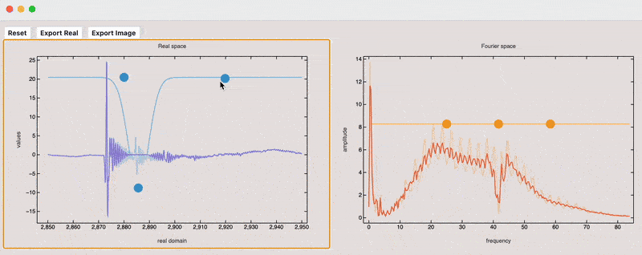

# Quick 3 band-stop filter

A EQ-like [band-stop filter](https://en.wikipedia.org/wiki/Band-stop_filter) mini app for processing any XY numerical data tables with interactive preview and real-time data manipulation

.png)

## Features

- Block or amplify bands in real or Fourier space
- See the changes immediately ✨
- Columns selection, importers for `csv`, `tsv`, `dat`, `xls` data
- Units agnostic

<a
  href={ require('./Bandblock_v1.wlw').default }
  className="p-2 text-sm w-full flex ring-1 ring-inset text-gray-600 font-medium shadow ring-gray-300 bg-gray-300 my-2"
>
  Download App v.01
  <svg
    xmlns="http://www.w3.org/2000/svg"
    fill="none"
    className="w-5 h-5 ml-auto"
    viewBox="0 0 24 24"
  >
    <path
      stroke="currentColor"
      strokeLinecap="round"
      strokeLinejoin="round"
      d="M17 17h.01m.39-3h.6c.932 0 1.398 0 1.765.152a2 2 0 0 1 1.083 1.083C21 15.602 21 16.068 21 17s0 1.398-.152 1.765a2 2 0 0 1-1.083 1.083C19.398 20 18.932 20 18 20H6c-.932 0-1.398 0-1.765-.152a2 2 0 0 1-1.083-1.083C3 18.398 3 17.932 3 17s0-1.398.152-1.765a2 2 0 0 1 1.083-1.083C4.602 14 5.068 14 6 14h.6m5.4 1V4m0 11-3-3m3 3 3-3"
    ></path>
  </svg>
</a>

<!--truncate-->

## In action

## Workflow

1. Import and select 2 columns (assumed to be XY)

2. Apply band-stoping 

It is designed in the way that your data is filtered in __real space__ first (left), then converted to __Fourier space__ and filtered there (right), and after that converted back to __real space__ with the same sampling used in the original data.

A user can export from both stages depending on the application.