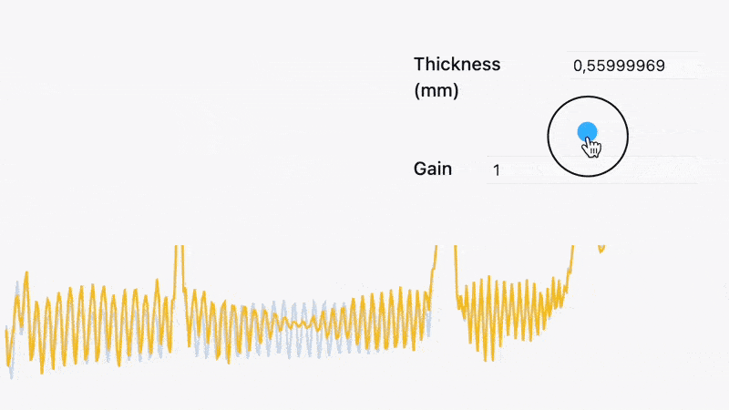

# TeraKitchen

It is an scientific software designed for automated analysis of optical time-domain transmission spectra (see [TDS-THz](https://en.wikipedia.org/wiki/Terahertz_time-domain_spectroscopy)). It features ~~AI-assisted~~ ML based reference/sample matching, Fabry–Pérot deconvolution, interactive phase unwrapping, and material parameter extraction—all integrated into a file-based workflow with automated reporting and metadata management.

<!--truncate-->

> Made with WLJS Notebook and TDS-Tools library ❤️
## Details
See more in the [__repository JerryI/TK__](https://github.com/JerryI/TK)

## Key-features

- **works with normal files, stores processed information as meta-data file `.TK_Store`**
- **automatic reference-sample pairs matching** using ELMo network
- **semiautomated advanced material parameters extraction**
- **Fabry-Pérot deconvolution (GPU accelerated if available)**
- **interactive phase unwrapping**
- **automated reports**
- easy exports to ASCII format

